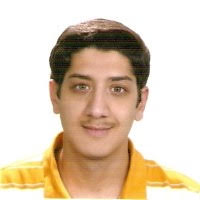
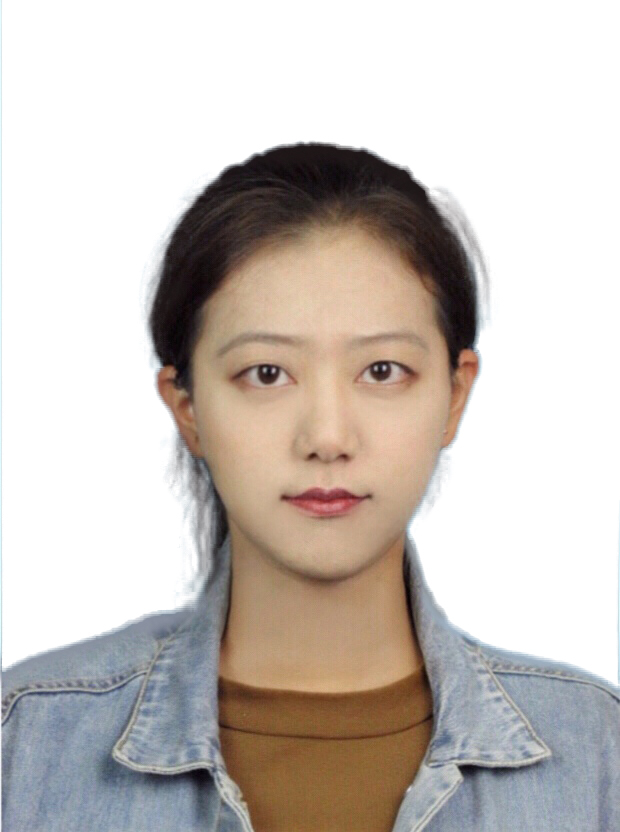
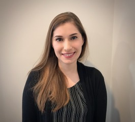

# Critical Information {-}

Welcome! This is the Fall 2020 syllabus for PQHS / CRSP / MPHP 431: Statistical Methods in Biological & Medical Sciences at Case Western Reserve University with Professor Thomas E. Love.

## Working with This Document {-}

1. This document is broken down into multiple sections. Use the table of contents at left to navigate. 
2. At the top of the document, you'll see icons which you can click to 
    - search the document, 
    - change the size, font or color scheme of the page, and 
    - download a PDF or Kindle version of the entire document.
3. The document is updated occasionally through the semester. Check the Version information above to verify the last update time.

## Who, When and Where? {-}

- The course instructor is [Professor Thomas E. Love][Professor Love]. 
  - Email him at **Thomas dot Love at case dot edu** if you have any questions before class.
- There are ten [teaching assistants][Teaching Assistants] helping with the course this semester.
- The course is given on Tuesdays and Thursdays from 1:00 to 2:15 PM Eastern Time, via Zoom, starting on 2020-08-25.

# How To Get Help 

Data science and statistical programming can be difficult. Computers are stupid and little errors in your code can cause hours of frustration (even if you've been doing this stuff for years!). **You shouldn't spend more than 15 minutes struggling with anything in this class without asking for help.**

Once the course begins, you have several ways to get help from us:

## Piazza is the place to ask questions

- We will use [Piazza](https://piazza.com/case/fall2020/pqhs431/home) this semester to facilitate questions and answers. We'll be conducting all class-related discussion there this term, instead of via email. 
- Find our class page at: https://piazza.com/case/fall2020/pqhs431/home. If you're successfully enrolled in the class, you should be able to sign up immediately.
  - The quicker you begin asking questions on Piazza (rather than via emails), the quicker you'll benefit from the collective knowledge of your classmates and instructors. 
  - We encourage you to ask questions when you're struggling to understand anything related to the class, and you can even do so anonymously.
- There are many, many online resources to help you learn R beyond those we provide. 
  - Googling effectively is an important skill that requires practice. Don't be afraid to use search engines to figure out how to code things in R, for example.
  - The [RStudio Community](https://community.rstudio.com/) is a forum specifically designed for people using RStudio and the tidyverse (and that will be you.)

## TA Office hours are the best way to get one-on-one help

- Teaching Assistant (TA) office hours will be held via Zoom, beginning 2020-08-31. 
  - A schedule will be available soon.
  - Office Hours are held for your benefit. Please visit the TAs, especially if you have questions about how to do things in R, or about the content of the class slides or course notes. They're volunteering their time to  help you, and most of them have been in your shoes in previous years. They want to help you!
  - More [information on the TAs is posted below][Teaching Assistants].
- Professor Love does not hold regular office hours. He will open Zoom 15 minutes before and keep it open after class to address any student concerns that you're willing to discuss in that sort of a semi-public forum. 
  - If you have any unique concerns about the course, need special accommodations or have any other issues you want to discuss with Professor Love specifically, please email him and he'll respond as quickly as possible.

## How We'll Use Canvas

Case uses the Canvas system for many classes. We'll use the Canvas platform for (only) two things:

- turning in assignments
- providing information about (and maintaining video recordings of) our Zoom sessions

Visit https://canvas.case.edu/ to log in and see what's available there.

## Course Home Page {-}

The course home page will include links to:

- The 431 Syllabus (this document)
- Dr. Love's Course Notes (which serve as the main textbook for the course)
- Materials for each class, including presentation slides, session recordings and announcements
- Data (and Code) for the course's assignments, presentations, and notes
- Readings and Supplemental Materials that we'll review during the course

## What Should I Do Before Class Starts?

1. Register and enroll in the course via the [CWRU Student Information System (SIS)](https://sis.case.edu/).
    - Note that PQHS 431, CRSP 431 and MPHP 431 are all identical.
2. Fill out the [Welcome to 431 Survey](https://bit.ly/431-2020-welcome-survey) at https://bit.ly/431-2020-welcome-survey.
    - Note that you must **log into Google via your CWRU account** in order to access the survey.
    - The survey should take 15-20 minutes to complete, and we encourage you to complete it well before class begins, if possible.
3. Review the rest of this syllabus to learn more about the books you'll need to purchase and download, and to obtain and install the software we'll use. 
4. Review [the CWRU Knowledge Base for Zoom](https://case.edu/utech/help/knowledge-base/zoom/zoom-information) to ensure you can join our first class on 2020-08-25 at 1 PM through your CWRU Zoom account.
5. Watch your CWRU email for further bulletins (including the Zoom links for the first few class sessions which will be posted to Canvas on 2020-08-24.)

### "Welcome to 431" Survey 

Most of you did this before class started, but if you haven't, please fill out the [Welcome to 431 Survey](https://bit.ly/431-2020-welcome-survey) at https://bit.ly/431-2020-welcome-survey to help us get to know you a little better.

# I am up to here, sort of?

### What Do I Need To Buy? {-}

We'll read two books that you'll need to purchase (the combined price is about \$25.):

1. Nate Silver's *The Signal and The Noise*. ISBN-13: 978-1594204111 [Amazon Link](https://www.amazon.com/Signal-Noise-Many-Predictions-Fail-but/dp/0143125087), and 
2. Jeff Leek's *The Elements of Data Analytic Style*, available at https://leanpub.com/datastyle.

Everything else that you will need is free, and is described in the remainder of this syllabus or on the course website at https://github.com/THOMASELOVE/2019-431.

```{r cwrulogo-fig, echo = FALSE, out.width = '20%'}
knitr::include_graphics("images/cwru-stacked-logo.jpg")
```

# Course Description

PQHS 431 (cross-listed as CRSP 431 and MPHP 431) is the first half of a two-semester sequence (with 432) focused on modern data analysis and advanced statistical modeling, with a practical bent and as little theory as possible. We emphasize the key role of thinking hard, and well, about design and analysis in research. 

The course is formally titled *Statistical Methods in Biological & Medical Sciences, Part 1.* A more accurate title is **Data Science for Biological, Medical or Health Research**.

We'll learn about managing and visualizing data, building models and making predictions, and other data science activities. This highly applied course focuses on modern tools for learning from data. We'll learn a lot of R, and we'll use RStudio and R Markdown as tools to help make R work better, and help perform our research in replicable ways.

## Course Objectives

During the 431-432 sequence, students will:

1. Use modern data science tools to import, tidy/manage, explore (through transformation, visualization and modeling) and communicate about data.
2. Think hard and well about design and analysis in scientific research.
3. Gain sufficient background in the practical issues regarding linear and generalized linear models to give you a starting place for meaningful applied work, particularly in terms of making comparisons to address general types of statistical and analytic questions (exploratory, predictive, inferential, and causal, in particular.)
4. Learn about the importance of replicable research, and develop facility and practice in open source tools for doing it.
5. Complete a series of assignments designed to help you demonstrate what you've learned. 
6. Program ("Code") in R sufficiently to accomplish the tasks above, with enough self-sufficiency afterwards to be able to debug and use new R tools without substantial troubleshooting help. What separates "doing data science" from "doing data analysis" is programming.

### Key Topics in 431 and 432

This is **NOT** a course in mathematical statistics or statistical inference. It's far more applied than that.

1. Exploratory Data Analysis: "All graphs are comparisons" including data exploration, statistical graphics and more general visualization of information.
2. Placing biological, medical and health research questions into a statistical framework.
3. Study Development - making choices in designing and executing the collection and aggregation of data.
4. Data Handling - including important issues in importing, tidying and transforming data, as well as methods for dealing with missing data, including imputation.
5. Statistical Comparisons: "All of statistics are comparisons" - including methods for discrete and continuous variables: intervals, assumptions, some thoughts on statistical power, and the bootstrap, design of visualizations and models for rates, proportions and contingency tables.
6. The proper use of multi-predictor models for continuous and discrete data, including...
    - Fitting, evaluating, and interpreting linear and generalized linear models.
    - Prediction and validation.
    - Critical role of graphics, including diagnostics and residual analysis.
    - Model choice, including variable selection, shrinkage and model uncertainty.
    - Dealing with categorical predictors and interactions meaningfully.
    - Causal inference using regression: controlling for covariates meaningfully.
7. Using R and RStudio to make all of the things above happen; with particular emphasis on doing replicable research and using Markdown to document the work.

### The 431 course is split in two parts. 

**Part A** (Classes 2-14, roughly) is mostly about R, Visualizing Data and Making Comparisons. 

Project A is focused on the material from this part of the course.

- Exploratory Data Analysis
    - Descriptive Numerical and Graphical Summaries
    - Distributions, specifically the Normal
    - Histograms and their cousins
    - Scatterplots and related tools from correlation and linear regression
- Exploring Data with the Tidyverse, Getting Up To Speed with R
    - Visualizing Data with `ggplot2`
    - Data Transformation and `dplyr`
    - Using scripts and projects, Building Code
    - Dealing with Missing Data
- Estimation and Inference for Means and Proportions (especially)
    - Confidence Intervals
    - Design Implications: Matched vs. Independent Samples
    - Hypothesis Testing Strategies and why significance isn't so helpful
    - Cross-Tabulations
    - Randomized Trials vs. Non-Randomized Studies

**Part B** (which starts around Class 15) is about Building Regression Models. 

Project B also incorporates material from this part of the course.

- Estimation and Inference using Ordinary Least Squares
    - Simple and Multivariate Linear Regression Models
    - Building Prediction Models, and Validating Them
    - Categorical Variables, Analysis of Variance
    - Analysis of Covariance
    - Residual and Influence Analyses
    - Foundations of Model / Feature / Variable Selection
    - What you've learned in the past and how it wasn't so helpful

## What We Expect You To Know Already

Not much.

Useful prior experience includes training/experience in statistics, coding/programming and biology/biomedical science. We expect most people will have some experience in one or two of these areas, but very few will have all three.

- Some students have lots of prior training in statistics. But there are many students in the class with no statistical training at all that they use regularly. We assume only that everyone knows what an average is, and has some sense of why statistics might be useful to them in their chosen field.  
- Some students have lots of prior coding and programming experience, including experience with R. Some have never written a line of code in their life.  We assume only that everyone is willing to learn how to do modern work with data, and that means writing computer code, but that some people will be starting from nothing.
- Some students have lots of prior experience with biological and biomedical science, and know a lot of useful things in those areas which relate directly to our work. Others have zero experience in this area, and will learn a lot from their colleagues. We assume only that everyone is willing to learn, and to put in some effort to do so.

People succeed in this course with a wide range of backgrounds and a common interest in using data effectively in research related to biology, health or medicine. There will be multiple people in the class who are years away from their last statistics class. We expect the majority of students will have no prior experience using R, or any meaningful recollection of using statistical software. 

The pace can be brisk at times, but all CWRU students who feel up to it are welcome, regardless of their field of study or prior experience.

## Learning During a Pandemic

Life is absolutely terrible right now. None of us is really okay. We're all just pretending.

You most likely know people who have lost their jobs, have tested positive for COVID-19, have been hospitalized, or perhaps have even died. You all have increased (or possibly decreased) work responsibilities and increased  care responsibilities - you might be caring for extra people (young and/or old!) right now, and you are likely facing uncertain job prospects.

I'm fully committed to making sure that you learn everything you were hoping to learn from this class! I will make whatever accommodations I can to help you finish your labs, do well on your quizzes and projects, and learn and understand the class material. Under ordinary conditions, I am flexible and lenient with grading and course expectations when students face difficult challenges. Under pandemic conditions, that flexibility and leniency is intensified. If you tell me you're having trouble, I will not judge you or think less of you. I hope you'll extend me the same grace.

You never owe me personal information about your health (mental or physical). You are always welcome to talk to me about things that you're going through, though. If I can't help you myself, I may know somebody who can.

If you need extra help, or if you need more time with something, or if you feel like you're behind or not understanding everything, do not suffer in silence! Talk to us! We will work with you. I promise.

I want you to learn lots of things from this class, but I primarily want you to stay healthy, balanced, and grounded during this crisis.

Thanks to [Andrew Heiss](https://econf20.classes.andrewheiss.com/syllabus/#learning-during-a-pandemic) for a lot of the better words here.

## R and RStudio

You will do all of your analysis with the open source (and free!) [programming language R](https://cloud.r-project.org). You will use [RStudio](https://www.rstudio.com/) as the main program to access R. Think of R as an engine and RStudio as a car dashboard. R handles all the calculations and the actual statistics, while RStudio provides a nice interface for running R code.

R is free, but it can sometimes be a pain to install and configure. Information about getting R and RStudio on your computer will be found on the [Software page](software.html)

Learning R can be difficult at first - it's like learning a new language, just like Spanish, French, or Chinese. Hadley Wickham-the chief scientist at RStudio and the author of some amazing R packages you'll be using like `ggplot2` [made this wise observation](https://r-posts.com/advice-to-young-and-old-programmers-a-conversation-with-hadley-wickham/):

> It's easy when you start out programming to get really frustrated and think, "Oh it's me, I'm really stupid," or, "I'm not made out to program." But, that is absolutely not the case. Everyone gets frustrated. I still get frustrated occasionally when writing R code. It's just a natural part of programming. So, it happens to everyone and gets less and less over time. Don't blame yourself. Just take a break, do something fun, and then come back and try again later.

If you're finding yourself taking way too long hitting your head against a wall and not understanding, take a break, talk to the teaching assistants, talk to classmates, ask questions, e-mail Dr. Love, etc.

I promise you can do this.

Some of this material is also borrowed from Andrew Heiss, for instance, from [here](https://evalf19.classes.andrewheiss.com/syllabus/) and [here](https://econf20.classes.andrewheiss.com/syllabus/).

## Special Needs

Students who wish to request accommodation for a disability may do so by registering with the [Disability Resources Office at the Division of Student Affairs](https://case.edu/studentlife/disability/). 

Students with special needs should then make an appointment with me during the first two weeks of class to discuss any accommodations that need to be made.

## Why I Teach 431 Like This

I have a lot of thoughts on this issue, but you may prefer to hear from other people on the subject. So here are a few references that have guided my recent thinking.

- [A Guide to Teaching Data Science](https://arxiv.org/abs/1612.07140) by Stephanie C. Hicks, Rafael A. Irizarry (pdf)
    - ... our (case-study) approach (in a graduate-level, introductory data science course) teaches students three key skills needed to succeed in data science, which we refer to as creating, connecting, and computing.
- [Data Visualization on Day One: Bringing Big Ideas into Intro Stats Early and Often](https://arxiv.org/abs/1705.08544) by Xiaofei Wang, Cynthia Rush, Nicholas Jon Horton (pdf)
- [50 Years of Data Science](https://www.tandfonline.com/doi/full/10.1080/10618600.2017.1384734) by David Donoho in the *Journal of Computational and Graphical Statistics*, 2017.
- [Why You Should Master R (Even if it might eventually become obsolete)](https://www.sharpsightlabs.com/blog/master-r-obsolete/) blog post from Sharp Sight, 2016-12-27
- [Teaching R to New Users - From tapply to the Tidyverse](https://simplystatistics.org/2018/07/12/use-r-keynote-2018/) by Roger D. Peng, which is also [available as a YouTube Video](https://www.youtube.com/watch?v=5033jBHFiHE&feature=youtu.be)
- [Teach the Tidyverse to Beginners](https://www.rstudio.com/resources/videos/teach-the-tidyverse-to-beginners/) from David Robinson at `rstudio::conf 2018` (video), and [here is the blog post](http://varianceexplained.org/r/teach-tidyverse/) and a [related post on teaching `ggplot2`, specifically](http://varianceexplained.org/r/teach_ggplot2_to_beginners/) from David.
- Video from Hadley Wickham, [You can't do data science in a GUI](https://www.youtube.com/watch?v=PURtmHwk_-0), 2018 in Chicago.

# Old Course Description

PQHS 431 (cross-listed as CRSP 431 and MPHP 431) is the first half of a two-semester sequence (with 432) focused on modern data analysis and advanced statistical modeling, with a practical bent and as little theory as possible. We emphasize the key role of thinking hard, and well, about design and analysis in research. 

The course is formally titled *Statistical Methods in Biological & Medical Sciences, Part 1.* A more accurate title is **Data Science for Biological, Medical or Health Research**.

We'll learn about managing and visualizing data, building models and making predictions, and other data science activities. This highly applied course focuses on modern tools for learning from data. We'll learn a lot of R, and we'll use RStudio and R Markdown as tools to help make R work better, and help perform our research in replicable ways.

## What Students Should Expect

During the 431-432 sequence, students will:

1. Use modern data science tools to import, tidy/manage, explore (through transformation, visualization and modeling) and communicate about data.
2. Think hard and well about design and analysis in scientific research.
3. Gain sufficient background in the practical issues regarding linear and generalized linear models to give you a starting place for meaningful applied work, particularly in terms of making comparisons to address general types of statistical and analytic questions (exploratory, predictive, inferential, and causal, in particular.)
4. Learn about the importance of replicable research, and develop facility and practice in open source tools for doing it.
5. Complete a series of assignments, including homeworks and quizzes on data provided for you, and course projects using data you select/develop. 
6. Program ("Code") in R sufficiently to accomplish the tasks above, with enough self-sufficiency afterwards to be able to debug and use new R tools without substantial troubleshooting help. What separates "doing data science" from "doing data analysis" is programming.

## 431 Class Outline

The 431 course **calendar** is linked at https://github.com/THOMASELOVE/2019-431. Go there for details on each class throughout the semester. 

The course is split in three parts. 

**Part A** (Classes 2-10) is mostly about R and Visualizing Data. 

- Exploratory Data Analysis
    - Descriptive Numerical and Graphical Summaries
    - Distributions, specifically the Normal
    - Histograms and their cousins
    - Scatterplots and related tools from correlation and linear regression
- Exploring Data with the Tidyverse, Getting Up To Speed with R
    - Visualizing Data with `ggplot2`
    - Data Transformation and `dplyr`
    - Using scripts and projects, Building Code
    
**Part B** (which starts around Class 11) is about Making Comparisons. 

- Estimation and Inference for Means and Proportions
    - Confidence Intervals
    - Design Implications: Matched vs. Independent Samples
    - Hypothesis Testing Strategies
    - Cross-Tabulations
    - Dealing with Missing Data
    - Randomized Trials vs. Non-Randomized Studies

**Part C** (which starts around Class 16) is about Building Regression Models. 

- Estimation and Inference using Ordinary Least Squares
    - Categorical Variables, Analysis of Variance
    - Simple and Multivariate Linear Regression Models
    - Building Prediction Models, and Validating Them
    - Analysis of Covariance
    - Residual and Influence Analyses
    - Foundations of Model / Feature / Variable Selection

## Key Topics in 431 and 432

1. Exploratory Data Analysis: "All graphs are comparisons" including data exploration, statistical graphics and more general visualization of information.
2. Placing biological, medical and health research questions into a statistical framework.
3. Study Development - making choices in designing and executing the collection and aggregation of data.
4. Data Handling - including important issues in importing, tidying and transforming data, as well as methods for dealing with missing data, including imputation.
5. Statistical Comparisons: "All of statistics are comparisons" - including methods for discrete and continuous variables: intervals, assumptions, some thoughts on statistical power, and the bootstrap, design of visualizations and models for rates, proportions and contingency tables.
6. The proper use of multi-predictor models for continuous and discrete data, including...
    - Fitting, evaluating, and interpreting linear and generalized linear models.
    - Prediction and validation.
    - Critical role of graphics, including diagnostics and residual analysis.
    - Model choice, including variable selection, shrinkage and model uncertainty.
    - Dealing with categorical predictors and interactions meaningfully.
    - Causal inference using regression: controlling for covariates meaningfully.
7. Using R and RStudio to make all of the things above happen; with particular emphasis on doing replicable research and using Markdown to document the work.

## What We Expect You To Know Already

Not much.

Useful prior experience includes training/experience in statistics, coding/programming and biology/biomedical science. We expect most people will have some experience in one or two of these areas, but very few will have all three.

- Some students have lots of prior training in statistics. But there are many students in the class with no statistical training at all that they use regularly. We assume only that everyone knows what an average is, and has some sense of why statistics might be useful to them in their chosen field.  
- Some students have lots of prior coding and programming experience, including experience with R. Some have never written a line of code in their life.  We assume only that everyone is willing to learn how to do modern work with data, and that means writing computer code, but that some people will be starting from nothing.
- Some students have lots of prior experience with biological and biomedical science, and know a lot of useful things in those areas which relate directly to our work. Others have zero experience in this area, and will learn a lot from their colleagues. We assume only that everyone is willing to learn, and to put in some effort to do so.

People succeed in this course with a wide range of backgrounds and a common interest in using data effectively in research related to biology, health or medicine. There will be multiple people in the class who are years away from their last statistics class. We expect the majority of students will have no prior experience using R, or any meaningful recollection of using statistical software. 

The pace can be brisk at times, but all CWRU students who feel up to it are welcome, regardless of their field of study or prior experience.

## R and RStudio

(borrowed from [Andrew Heiss](https://evalf19.classes.andrewheiss.com/syllabus/))

You will do all of your analysis with the open source (and free!) [programming language R](https://cloud.r-project.org). You will use [RStudio](https://www.rstudio.com/) as the main program to access R. Think of R as an engine and RStudio as a car dashboard. R handles all the calculations and the actual statistics, while RStudio provides a nice interface for running R code.

R is free, but it can sometimes be a pain to install and configure. To make life easier, you can (and should!) use [the free RStudio.cloud service](http://rstudio.cloud/), which lets you run a full instance of RStudio in your web browser. This means you won't have to install anything on your computer to get started with R! We will have a shared class workspace in RStudio.cloud that will let you quickly copy templates for some of your work, too.

RStudio.cloud is convenient, but it can be slow and it is not designed to be able to handle larger datasets or more complicated analysis. Over the course of the semester, you'll probably want to get around to installing R, RStudio, and other R packages on your computer and wean yourself off of RStudio.cloud. This isn't absolutely necessary early on, but you'll probably feel the need to have done it by the end of September. You'll find [complete instructions for installing, R, RStudio, the R packages we'll use and the data and code we've built for 431](https://thomaselove.github.io/2019-431-syllabus/on-software-and-r.html) here.

## Pep Talk! (Thanks, [Andrew Heiss](https://evalf19.classes.andrewheiss.com/syllabus/#pep-talk))

Learning R can be difficult at first - it's like learning a new lanugage, just like Spanish, French, or Chinese. Hadley Wickham-the chief data scientist at RStudio and the author of some amazing R packages you'll be using like `ggplot2` [made this wise observation](https://r-posts.com/advice-to-young-and-old-programmers-a-conversation-with-hadley-wickham/):

> It's easy when you start out programming to get really frustrated and think, "Oh it's me, I'm really stupid," or, "I'm not made out to program." But, that is absolutely not the case. Everyone gets frustrated. I still get frustrated occasionally when writing R code. It's just a natural part of programming. So, it happens to everyone and gets less and less over time. Don't blame yourself. Just take a break, do something fun, and then come back and try again later.

If you're finding yourself taking way too long hitting your head against a wall and not understanding, take a break, talk to classmates, ask questions at `431-help at case dot edu`, e-mail Dr. Love, etc.

I promise you can do this.

## Why I Teach 431 Like This

I have a lot of thoughts on this issue, but you may prefer to hear from other people on the subject. So here are a few references that have guided my recent thinking.

- [A Guide to Teaching Data Science](https://arxiv.org/abs/1612.07140) by Stephanie C. Hicks, Rafael A. Irizarry (pdf)
    - ... our (case-study) approach (in a graduate-level, introductory data science course) teaches students three key skills needed to succeed in data science, which we refer to as creating, connecting, and computing.
- [Data Visualization on Day One: Bringing Big Ideas into Intro Stats Early and Often](https://arxiv.org/abs/1705.08544) by Xiaofei Wang, Cynthia Rush, Nicholas Jon Horton (pdf)
- [50 Years of Data Science](https://www.tandfonline.com/doi/full/10.1080/10618600.2017.1384734) by David Donoho in the *Journal of Computational and Graphical Statistics*, 2017.
- [Why You Should Master R (Even if it might eventually become obsolete)](https://www.sharpsightlabs.com/blog/master-r-obsolete/) blog post from Sharp Sight, 2016-12-27
- [Teaching R to New Users - From tapply to the Tidyverse](https://simplystatistics.org/2018/07/12/use-r-keynote-2018/) by Roger D. Peng, which is also [available as a YouTube Video](https://www.youtube.com/watch?v=5033jBHFiHE&feature=youtu.be)
- [Teach the Tidyverse to Beginners](https://www.rstudio.com/resources/videos/teach-the-tidyverse-to-beginners/) from David Robinson at `rstudio::conf 2018` (video), and [here is the blog post](http://varianceexplained.org/r/teach-tidyverse/) and a [related post on teaching `ggplot2`, specifically](http://varianceexplained.org/r/teach_ggplot2_to_beginners/) from David.
- Video from Hadley Wickham, [You can't do data science in a GUI](https://www.youtube.com/watch?v=PURtmHwk_-0), 2018 in Chicago.


# Professor Love

```{r Lovepic-fig, echo = FALSE, out.width = '30%'}
knitr::include_graphics("images/Thomas_Love.png")
```

Thomas E. Love, Ph.D.

- Professor of Medicine, Population and Quantitative Health Sciences, [CWRU](http://case.edu/)
- Director of [Biostatistics and Evaluation](http://chrp.org/biostatistics-evaluation/), [Center for Health Care Research & Policy](http://chrp.org/), [MetroHealth Medical Center](https://www.metrohealth.org/research)
- [Chief Data Scientist](http://www.betterhealthpartnership.org/data_center/), [Better Health Partnership](http://betterhealthpartnership.org/)
- Track Lead for Health Care Analytics, MS in Biostatistics, [Department of Population and Quantitative Health Sciences](http://epbiwww.case.edu/), CWRU
- Fellow, [American Statistical Association](http://www.amstat.org/)

## A More Complete Biography 

Hi. I am Thomas E. Love, Ph.D. and I have at least three different jobs.

- I am a Professor in the Departments of Medicine and Population & Quantitative Health Sciences at Case Western Reserve University. I teach three courses per year there (PQHS 431, 432 and 500) and also lead the Health Care Analytics track of the MS program in Biostatistics.
- I direct [Biostatistics and Evaluation](http://chrp.org/biostatistics-evaluation/) at the [Center for Health Care Research & Policy](http://chrp.org/), which is a joint venture of CWRU and MetroHealth Medical Center.
- For ten years, I was the (founding) Data Director for [Better Health Partnership](http://betterhealthpartnership.org/), an alliance of people who provide, pay for and receive care in Northeast Ohio. I now serve as Chief Data Scientist there.
- I am a Fellow of the American Statistical Association, and have won numerous awards for my teaching and my research, including the 2018 [John S. Diekhoff Award for Graduate Teaching](https://students.case.edu/traditions/awards/diekhoff/) from CWRU.
- I have been teaching at CWRU since 1994, and have taught every manner of CWRU student over the years, especially students in biostatistics, medicine, and management.

In research, I use statistical methods to look at questions in health policy and in particular the provision of health services. I mostly work with observational data, rather than data that emerge from randomized clinical trials, and I have a special interest in working with data from electronic health records.

- You may be interested in a [recent study in Health Affairs](http://content.healthaffairs.org/content/34/7/1121.abstract) showing the impact of a [Medicaid-like expansion plan on care and outcomes of poor patients in Cleveland](http://thedaily.case.edu/new-study-shows-prepared-safety-net-improves-care-saves-money-in-medicaid-expansion-population/).
- Or you might be interested in our [New England Journal of Medicine study](http://www.nejm.org/doi/full/10.1056/NEJMsa1102519) of the effect of electronic health records on the care and outcomes of people with diabetes.
- In 2011, [James O'Malley](http://tdi.dartmouth.edu/faculty/a-james-omalley-phd) and I chaired the [Ninth International Conference on Health Policy Statistics](https://ww2.amstat.org/meetings/ichps/2011/index.cfm?fuseaction=main), here in Cleveland. Here's a [recap](https://link.springer.com/article/10.1007%2Fs10742-012-0096-8). 
- I've also worked on many projects involving the use of propensity scores to make causal inferences from observational studies, particularly in heart failure.

If you want to see a [pretty complete list of my publications](https://www.ncbi.nlm.nih.gov/myncbi/thomas.love.1/bibliography/public/), knock yourself out. 

I hold degrees from Columbia University in the City of New York and from the University of Pennsylvania. My dissertation adviser was Paul Rosenbaum. I am married to a brilliant woman who is an attorney at GE Lighting, and we are raising two terrific sons, one in college (University of Pittsburgh), and one finishing high school this year. I live in Shaker Heights. I also sing and act occasionally in [community theater](https://github.com/THOMASELOVE/theater).

## Email 

- Email to get help with the course: **431-help at case dot edu** (seen by Professor Love and the TAs)
- `Thomas dot Love at case dot edu` (for matters related to grades or individual concerns)
- Professor Love is hard to reach by phone. Email is always the best way to reach him.

## Offices 

- Wood WG-82J on the ground floor of the Wood building (Tuesdays and Thursdays)
- Rammelkamp R-229A at MetroHealth Medical Center (Wednesdays and Fridays)

Professor Love is available for the 15 minutes before and the 30 minutes after each class, and otherwise by appointment on Tuesdays and Thursdays (send email to schedule). 

## Name and Pronouns 

- Professor Love uses he/him/his pronouns.
- Most students refer to him either as Professor Love or Dr. Love.
- He prefers his given name to be written "Thomas" as opposed to "Tom".
- Most of his friends and colleagues call him "Tom". You are welcome to do so, as well, if that makes you more comfortable.

## Web 

- Professor Love's [GitHub pages website](https://thomaselove.github.io/). 
    + His GitHub name is [THOMASELOVE](https://github.com/thomaselove).
- His Twitter handle is [ThomasELove](https://twitter.com/ThomasELove).

## Offices 

- Home in Shaker Heights
- Prior to the pandemic
    - Wood WG-82J on the ground floor of the Wood building
    - Rammelkamp R-229A at MetroHealth Medical Center

Professor Love is available for the 15 minutes before and the 30 minutes after each class, and otherwise by appointment most days (send email to schedule an appointment.) 


# Teaching Assistants

Most of this year's stellar group of teaching assistants has been in your shoes - they've taken the course in the past, and they enjoyed it enough to come back for more. They are volunteering their precious time and energy to help make the course happen, and we couldn't be more delighted to welcome you to the course. 

To contact Professor Love and the TAs, email **431-help at case dot edu**. This is a difficult class for many people. Don't suffer in silence - talk to us!

## Office Hours for TAs

Most of the office hours for this course are held by the teaching assistants. All office hours are held via Zoom. TA Office Hours will begin in late August, and a schedule is forthcoming.

You are strongly encouraged to visit TAs during office hours that are convenient for you, whenever you need help with the course. This is the best way to get one-on-one help, or try out a new idea. 


## Office Hours for TAs

Teaching Assistant Office Hours are held in WG-56 (Computing Lab) or WG-67 (Student Lounge) on the ground floor of the Wood building, so be sure to look in both places if you need help. 

TA Office Hours begin on 2019-09-03. The schedule is posted at the bottom of the [Course Calendar](https://github.com/THOMASELOVE/2019-431/blob/master/calendar.md).

Most of this year's stellar group of teaching assistants has been in your shoes - they've taken the course in the past, and they enjoyed it enough to come back for more. They are volunteering their precious time and energy to help make the course happen, and we couldn't be more delighted to welcome you to the course. 

To contact Professor Love and the TAs, email **431-help at case dot edu**. This is a difficult class for many people. Don't suffer in silence - talk to us!

## Office Hours for TAs

Most of the office hours for this course are held by the teaching assistants. All office hours are held via Zoom. TA Office Hours will begin in late August, and a schedule is forthcoming.

You are strongly encouraged to visit TAs during office hours that are convenient for you, whenever you need help with the course. This is the best way to get one-on-one help, or try out a new idea. 

## This year's Teaching Assistants {.tabset}


### Complete List

Click on the tabs above to learn a little more about each of our Fall 2020 teaching assistants.

- Stephanie Merlino Barr, third year PhD student in Clinical Translational Science
- Wyatt Bensken, third year PhD student in Epidemiology \& Biostatistics
- Lauren Cruz, first year PhD student in Epidemiology \& Biostatistics
- Dustin DeMeo, third year medical student at CWRU
- Daoyu Duan, first year PhD student in Epidemiology \& Biostatistics
- Guanqun (Leslie) Meng, first year PhD student in Epidemiology \& Biostatistics 
- Allen Schweickart, recent MS graduate at CWRU transitioning into data science
- Khaled Shorbaji, second year MPH student
- Siyu Wang, second year MS student in Biomedical Engineering
- Anastasia Vassiliou, second year MS student in Clinical Research


### Stephanie Merlino Barr

```{r Stephanie_fig, echo = FALSE, out.width = '20%'}
knitr::include_graphics("images/Stephanie_Merlino_Barr.jpg")
```

Stephanie Merlino Barr is a third year PhD student in the Clinical Translational Science program and a full-time dietitian in the Neonatal Intensive Care Unit (NICU) at MetroHealth Medical Center. Stephanie's research focuses on the relationship of early life nutrition interventions and long-term growth and developmental outcomes in very low birthweight infants. While Stephanie changed her undergraduate major to avoid a class with a programming requirement, she has immensely enjoyed learning R in 431 and 432. Stephanie has been using her R skills to create a database to assess nutrition-related outcomes for preterm infants in MetroHealth's NICU. In the pre-pandemic era, Stephanie enjoyed rowing, traveling, and attending concerts. Now, she spends her time hiking with her dog and making pasta.

### Wyatt Bensken

```{r Wyatt_fig, echo = FALSE, out.width = '20%'}
knitr::include_graphics("images/Wyatt_Bensken.jpeg")
```

Wyatt Bensken is a PhD Candidate in epidemiology and biostatistics in PQHS. Wyatt received his bachelors of science in public health from American University in Washington, DC, after which he worked as a research fellow at the National Institutes of Health in Bethesda, Maryland before joining the PhD program here in 2018. Wyatt took 431 and 432 in 2018/2019, as well as 500 in 2020. His research includes health services and population health research to identify disparities in health and health outcomes. In addition to projects in surgery, cancer, and social determinants of health, Wyatt's dissertation focuses on health disparities and multimorbidity for people with epilepsy. 

### Lauren Cruz

```{r Lauren_fig, echo = FALSE, out.width = '20%'}
knitr::include_graphics("images/Lauren_Cruz.jpg")
```

Lauren Cruz is a first year student in the PhD epidemiology and biostatistics program. She earned her MPH with a focus in population health at CWRU in Spring 2020. Lauren has a background in biological anthropology and is interested in genetic epidemiology and evolutionary development. When she's not studying, you can likely find her cooking, gardening, or cycling. As part of her Master's culminating experience, Lauren worked with Dr. Love through Better Health Partnership to evaluate a community healthcare outreach program involving a diverse patient population. She took 431/432 last cycle and is eager to work with this year's cohort to explore different ways to approach the key statistical concepts taught in this course series.

### Dustin DeMeo

```{r Dustin_fig, echo = FALSE, out.width = '20%'}

```

Dustin DeMeo, a third year student in the CWRU School of Medicine, is currently doing a year-long research fellowship. He received his undergraduate degree from the University of Pennsylvania where he dual-majored in Computer Science and Business. Before changing careers to medicine, Dustin worked in the finance industry. He looks forward to getting to know you and working with you this semester.

### Daoyu Duan

```{r Daoyu_fig, echo = FALSE, out.width = '20%'}
knitr::include_graphics("images/Daoyu_duan.jpg")
```

Daoyu Duan is a 1st year PhD student in Epidemiology & Biostatistics. I got my Bachelor degree in Math&Stats from UIUC and MS degree in Biostatistics from Columbia University. Before coming to CWRU, I have been working in a Pharmaceutical company called Regeneron for 2 years. My current research interest is sequencing data analysis. I enjoy video games, cooking and swimming most of the time.

### Guanqun (Leslie) Meng

```{r Leslie_fig, echo = FALSE, out.width = '20%'}
knitr::include_graphics("images/Leslie_Meng.jpg")
```

Leslie (Guanqun) Meng is a first year PhD student Epidemiology/Biostatistics program. He received his M.S degree in Biostatistics from Yale University in May 2020. He has been working extensively in RCTs and Observational Studies, with major focuses on building new survival models and deriving a novel propensity score weighting method. Leslie ran Marathon twice (4 hours), and now he is addicted to bodybuilding.

### Allen Schweickart

```{r Allen_fig, echo = FALSE, out.width = '20%'}
knitr::include_graphics("images/Allen_Schweickart.jpg")
```

Allen Schweickart has recently earned his Master's of Science degree here at CWRU and is looking to make the transition into data science. For his master's thesis, he analyzed cell migration in Drosophila. With the skills he learned in 431 and 432, he was able to model distinct characteristics of various genotypes and identify how they might influence migration. Allen's hobbies include bodybuilding, hiking, gaming, and trying not to burn the food he is cooking.

### Khaled Shorbaji

```{r Khaled_fig, echo = FALSE, out.width = '20%'}

```

Khaled Shorbaji is in his second year in the Master of Public Health program's Intensive Research Pathway. Khaled is an international medical graduate from Syria, and he is very interested in cardiac surgery outcomes research. Khaled took 431 and 432 last year and has appreciated how the skills he learned in those classes have helped him as a cardiac surgery research fellow at University Hospitals Cleveland Medical Center. Khaled enjoys playing ping-pong, volleyball, chess, and reading. 

### Siyu Wang

```{r Siyu_fig, echo = FALSE, out.width = '20%'}

```

Siyu Wang is in her second year in the M.S. program in Biomedical Engineering. She is an international student from China, and she completed her Bachelor's work in Biomedical Engineering in Shanghai Jiao Tong University. She has previously completed 431 and 432 coursework and learned many skills, which are very helpful for her project at Cleveland Clinic. Siyu likes cooking, reading, watching movies and photographing. 

### Anastasia Vassiliou

```{r Anastasia_fig, echo = FALSE, out.width = '20%'}

```

Anastasia Vassiliou is in her second year in the M.S program in Clinical Research. She completed her bachelor's in Molecular Biology and Biotechnology. For her thesis she studied the role of Circulating Tumor Cells in cancer metastasis. Anastasia took 431 and 432 this past year and can't wait to apply the skills she learned in future research projects. Anastasia enjoys spending time with her family, cooking, reading, and hiking. 

# Required Texts

## Professor Love's Materials

The main text is a set of Notes for the course, maintained by Professor Love. The title is "Data Science for Biological, Medical and Health Research: Notes for PQHS 431". 

Professor Love is revising the Notes extensively this year, so they will appear as the semester progresses. The 2018 version of the Notes is available, too. 

Although the Notes share some of the features of a textbook, they are neither comprehensive nor completely original. The main purpose is to give 431 students a set of common materials on which to draw during the course, providing a series of examples using R to work through issues that are likely to come up during the semester. Again, this is work in progress, and updates will occur irregularly as the semester progresses.

**Slides** from each of Professor Love's lectures, plus other in-class materials from each session of the class will be posted before and after each class as part of daily README files discussed at the start of each session. 

Visit https://github.com/THOMASELOVE/2019-431 for links to all materials.

## Two Books To Purchase

In addition, we'll read two books that you'll need to purchase (the combined price is about \$25.):

1. Nate Silver's *The Signal and The Noise* ISBN-13: 978-1594204111 [Amazon Link](https://www.amazon.com/Signal-Noise-Many-Predictions-Fail-but/dp/0143125087), and 
2. Jeff Leek's *The Elements of Data Analytic Style*, available at https://leanpub.com/datastyle.

With regard to *The Signal and the Noise*, you can watch Nate discuss the book's ideas in many places, for instance, at [this YouTube link](https://www.youtube.com/watch?v=z4zhI9uLs4U), or [this one on the Art and Science of Prediction](https://www.youtube.com/watch?v=eE4qCJBgfIk), or [this one at Google](https://www.youtube.com/watch?v=mYIgSq-ZWE0). We'll also spend considerable time visiting the [FiveThirtyEight](http://fivethirtyeight.com/) website, where Nate is editor-in-chief.

## Four Books to Download

There are four books that you will definitely need to obtain during the semester. All are freely available to you, at the links below.

1. [R for Data Science](https://r4ds.had.co.nz/) by Garrett Grolemund and Hadley Wickham
2. [Biostatistics for Biomedical Research](http://hbiostat.org/doc/bbr.pdf) (pdf) by Frank E. Harrell Jr and James C Slaughter
3. [OpenIntro Statistics](https://leanpub.com/openintro-statistics) by David Diez and Mine Cetinkaya-Rundel (4th Edition) and [supplementary material is here](https://www.openintro.org/stat/textbook.php?stat_book=os)
4. [Modern Dive: Statistical Inference via Data Science (A Modern Dive into R and the Tidyverse)](https://moderndive.netlify.com/) by Chester Ismay and Albert Y. Kim.

## Articles and Posts

While I will recommend dozens, perhaps hundreds of articles, blog posts and the like to you over the course of the year, these are especially important in 431.

1. Several of the guides prepared by Jeff Leek and his group, including:
    + [Finally, a Formula for Decoding Health News](https://fivethirtyeight.com/features/a-formula-for-decoding-health-news/), from fivethirtyeight.com
    + [Reading academic (scientific) papers](https://github.com/jtleek/readingpapers),
    + [Writing your first academic paper](https://github.com/jtleek/firstpaper)
    + [Write papers like a modern scientist](https://simplystatistics.org/2016/04/21/writing/)
    + [How to Share Data for Collaboration](https://www.tandfonline.com/doi/abs/10.1080/00031305.2017.1375987) by Shannon E. Ellis and Jeffrey T. Leek in *The American Statistician*, 2018 Special Issue on Data Science, or you can [read the PeerJ preprint version here](https://peerj.com/preprints/3139/).
2. [Data Organization in Spreadsheets](https://www.tandfonline.com/doi/full/10.1080/00031305.2017.1375989) by Karl W. Broman and Kara H. Woo in The American Statistician, 2018 Special Issue on Data Science, or you can [read the PeerJ preprint version](https://peerj.com/preprints/3183/).
    + The Ellis/Leek and Broman/Woo papers are part of the [Practical Data Science for Stats](https://peerj.com/collections/50-practicaldatascistats/) collection, which may be of interest.
3. [Project-oriented workflow](https://www.tidyverse.org/articles/2017/12/workflow-vs-script/) at tidyverse.org from Jenny Bryan.
4. From the Ten Simple Rules series at PLOS Computational Biology:
    + [Ten Simple Rules for Effective Statistical Practice](http://journals.plos.org/ploscompbiol/article?id=10.1371%2Fjournal.pcbi.1004961) by Kass RE et al. 2016
    + [Ten Simple Rules for Graduate Students](http://journals.plos.org/ploscompbiol/article?id=10.1371/journal.pcbi.0030229) by Gu J Bourne PE 2007
    + [Ten Simple Rules for Better Figures](http://journals.plos.org/ploscompbiol/article?id=10.1371/journal.pcbi.1003833) by Rougier NP Droettboom M Bourne PE 2014
    + [Ten Simple Rules for Creating a Good Data Management Plan](http://journals.plos.org/ploscompbiol/article?id=10.1371/journal.pcbi.1004525) by Michener WK 2015
5. [Statistical Inference in the 21st Century: A World Beyond *p* < 0.05](https://amstat.tandfonline.com/toc/utas20/73/sup1) from 2019 in *The American Statistician*
6. The American Statistical Association's 2016 [Statement on p-Values](http://amstat.tandfonline.com/doi/full/10.1080/00031305.2016.1154108): Context, Process and Purpose.

Links to all required and recommended materials appear on the [Course Website's READINGS page](https://github.com/THOMASELOVE/2019-431/tree/master/READINGS).

# Worthy (and Free) Resources

Many of these resources will come up again in class, but no one can keep up with all of this material. Pick things that interest you to follow up with. And I'm always eager to receive additional suggestions from students in the class. If you find a helpful resource, please send it along to **431-help at case dot edu**.

## Data Visualization Books

1. [R Graphics Cookbook, 2nd Edition](https://r-graphics.org/) by Winston Chang.
2. [Data Visualization: A Practical Introduction](http://socviz.co/) by Kieran Healy.
3. [Fundamentals of Data Visualization](https://serialmentor.com/dataviz/) by Claus O. Wilke
4. [Data Visualization with R](https://rkabacoff.github.io/datavis/) by Rob Kabacoff
5. [Interactive web-based data visualization with R, plotly, and shiny](https://plotly-r.com/) by Carson Sievert

## Statistics/Data Analysis/Data Science Books

1. [The Art of Data Science](https://leanpub.com/artofdatascience) by Roger D. Peng and Elizabeth Matsui (book is also available with lecture videos). An earlier edition is available at [bookdown](https://bookdown.org/rdpeng/artofdatascience/).
2. [Exploratory Data Analysis with R](https://leanpub.com/exdata) by Roger D. Peng. An earlier edition is available at [bookdown](https://bookdown.org/rdpeng/exdata/)
3. [Data Analysis for the Life Sciences](https://leanpub.com/dataanalysisforthelifesciences) by Rafael A. Irizarry and Michael I. Love
4. [Modern Statistics for Modern Biology](http://web.stanford.edu/class/bios221/book/) by Susan Holmes and Wolfgang Huber
5. [Regression Models for Data Science in R](https://leanpub.com/regmods) by Brian Caffo
6. [Introduction to Data Science: Data Analysis and Prediction Algorithms with R](https://rafalab.github.io/dsbook/) by Rafael A. Irizarry
7. [Practical Regression and ANOVA using R](https://cran.r-project.org/doc/contrib/Faraway-PRA.pdf) by Julian J. Faraway (pdf)
8. [A First Course in Design and Analysis of Experiments](http://users.stat.umn.edu/~gary/book/fcdae.pdf) by Gary W. Oehlert (pdf)

## R and R Markdown Books

1. [Cookbook for R](http://www.cookbook-r.com/) by Winston Chang
2. [Learning Statistics with R](https://learningstatisticswithr.com/) and its [bookdown repository](https://learningstatisticswithr.com/book/index.html) by Danielle Navarro
3. [R Programming for Data Science](https://leanpub.com/rprogramming) by Roger D. Peng. An earlier edition is available at [bookdown](https://bookdown.org/rdpeng/rprogdatascience/)
4. [R Markdown: The Definitive Guide](https://bookdown.org/yihui/rmarkdown/) by Yihui Xie, J. J. Allaire, and Garrett Grolemund
5. [R Markdown for Scientists](https://rmd4sci.njtierney.com/) by Nicholas Tierney
6. [R Packages](https://r-pkgs.org/) by Hadley Wickham and Jenny Bryan
7. [What They Forgot to Teach You About R](https://whattheyforgot.org/) by Jenny Bryan and Jim Hester
8. [Advanced R](https://adv-r.hadley.nz/) by Hadley Wickham (2nd edition)
9. [Hands-On Programming with R](https://rstudio-education.github.io/hopr/) by Garrett Grolemund

## Blogs and Internet Columns

1. Andrew Gelman and friends at [Statistical Modeling, Causal Inference, and Social Science](https://statmodeling.stat.columbia.edu/)
2. [Simply Statistics](https://simplystatistics.org/) by Jeff Leek, Brian Caffo, Roger Peng, Rafael Irizarry and others
3. Frank Harrell's [Statistical Thinking](https://www.fharrell.com/) blog
4. [FlowingData](https://flowingdata.com/) by Nathan Yau
5. [JunkCharts](https://junkcharts.typepad.com/) by Kaiser Fung
6. New York Times [What's Going On in this Graph?](https://www.nytimes.com/column/whats-going-on-in-this-graph)
7. [Edward Tufte on the Web](https://www.edwardtufte.com/tufte/)
8. [Tidy Tuesdays](https://github.com/rfordatascience/tidytuesday): A weekly data project in R from the R for Data Science online learning community
9. [FiveThirtyEight](https://fivethirtyeight.com/) on Politics, Sports, Science & Health, Economics and Culture. Nate Silver is Editor-in-Chief.

## Resources for Learning R

1. I recommend the [Community-Sourced Data Science Guide](https://github.com/Chris-Engelhardt/data_sci_guide) of resources for learning data science.
    - I no longer support DataCamp in any way, and suggest that you don't, either. See [R-Ladies Global on the matter](https://blog.rladies.org/post/statement-about-datacamp/).
2. [RStudio Cheat Sheets](https://www.rstudio.com/resources/cheatsheets/) are definitely worth your time. In 431, you'll especially like:
  - Data Transformation with `dplyr`
  - Data Visualization with `ggplot2`
  - Data Import
  - R Markdown
3. The `swirl` package in R can be a great help for people learning R programming and data science. Find out more about it at http://swirlstats.com/students.html
4. UCLA's Institute for Digital Research and Education has some great [Data Analysis Examples](https://stats.idre.ucla.edu/other/dae/) using R (and other software.)

## Videos about R and Data Science

1. [Resources from RStudio](https://resources.rstudio.com/) is a great source of all kinds of useful stuff. For example:
  - [Getting Started with R Markdown](https://www.rstudio.com/resources/webinars/getting-started-with-r-markdown/)
  - [Getting Your Data into R](https://www.rstudio.com/resources/webinars/getting-your-data-into-r/)
  - [Data Wrangling with R and RStudio](https://www.rstudio.com/resources/webinars/data-wrangling-with-r-and-rstudio/)
  - Six part series on [RStudio Essentials](https://www.rstudio.com/resources/webinars/rstudio-essentials-webinar-series-part-1/) (Parts 1 and 2 of each section are likely to be of greater interest in 431.)
  - [Data Science Essentials](https://resources.rstudio.com/the-essentials-of-data-science)
  - [RStudio Webinars](https://resources.rstudio.com/webinars) on a variety of subjects, most of which are gathered in [this YouTube playlist](https://www.youtube.com/playlist?list=PL9HYL-VRX0oRDOP3T5ojgSnMtQdityqEk) as well.
2. [Data Wrangling with R and the Tidyverse YouTube Playlist](https://www.youtube.com/playlist?list=PL9HYL-VRX0oQOWAFoKHFQAsWAI3ImbNPk) from Garrett Grolemund
3. Hadley Wickham's [Whole Game](https://www.youtube.com/watch?v=go5Au01Jrvs)
4. [Tidy Tuesday Screencasts from David Robinson on YouTube](https://www.youtube.com/channel/UCeiiqmVK07qhY-wvg3IZiZQ)
5. [Hans Rosling: The Best Stats You've Ever Seen](https://www.ted.com/talks/hans_rosling_shows_the_best_stats_you_ve_ever_seen) TED Talk from 2006.
6. [This is Statistics: Roger Peng](https://www.youtube.com/watch?v=WMDAR2bZEp0) explains in less than two minutes why statistics is an amazing field.
7. Mona Chalabi's TED Talk on [3 ways to spot a bad statistic](https://www.ted.com/talks/mona_chalabi_3_ways_to_spot_a_bad_statistic),  2017.
8. [The beauty of data visualization](https://www.youtube.com/watch?v=5Zg-C8AAIGg) from David McCandless at TEDGlobal 2010.
9. [Six Types of Questions You Can Ask in a Data Analysis](https://www.youtube.com/watch?v=GRNyEzQ26Ww) from Roger Peng.
10. [Videos from Coursera's 4 week course "Computing for Data Analysis" in R](https://blog.revolutionanalytics.com/2012/12/coursera-videos.html)
11. [Learn R by Intensive Practice](https://www.youtube.com/user/TheLearnR) list of tutorials on YouTube.

## Podcasts

1. [Not So Standard Deviations](http://nssdeviations.com/) by Hilary Parker and Roger Peng talking about the latest in data science and data analysis in academia and industry.
2. [The Effort Report](http://theeffortreport.com/) by Elizabeth Matsui and Roger Peng talking about life in the academic trenches, telling it "like it is". Every graduate student in this course looking at a career in academia would benefit from listening.
3. [More or Less: Behind the Stats](https://www.bbc.co.uk/programmes/p02nrss1) from Tim Harford and BBC Radio 4
4. [Stats + Stories](https://statsandstories.net/) from the American Statistical Association and Miami University
5. [The R-Podcast](https://r-podcast.org/)

## Books on related topics

1. [Broadening Your Statistical Horizons: Generalized Linear Models and Multilevel Models](https://bookdown.org/roback/bookdown-bysh/) by Julie Legler and Paul Roback
2. [Computer Age Statistical Inference: Algorithms, Evidence and Data Science](https://web.stanford.edu/~hastie/CASI_files/PDF/casi.pdf) by Bradley Efron and Trevor Hastie (pdf)
3. [An Introduction to Statistical Learning with Applications in R](http://faculty.marshall.usc.edu/gareth-james/ISL/) by Gareth James, Daniela Witten, Trevor Hastie and Robert Tibshirani
4. [*Statistical Rethinking* with `brms`, `ggplot2` and the tidyverse](https://bookdown.org/ajkurz/Statistical_Rethinking_recoded/) by A. Solomon Kurz, building off of Richard McElreath's [*Statistical Rethinking* text](http://xcelab.net/rm/statistical-rethinking/) and [freely-available lectures](https://www.youtube.com/channel/UCNJK6_DZvcMqNSzQdEkzvzA/playlists).
5. [Think Bayes: Bayesian Statistics Made Simple](http://www.greenteapress.com/thinkbayes/thinkbayes.pdf) by Allen B. Downey (pdf)

Additional references and links will appear over the course of the semester in the README files associated with each class.

# On Software, and R

The course makes heavy use of the R statistical programming language, and several related tools, most especially the RStudio development environment. Every bit of this software is free to use, and open-source.

- There will be many people in the course for whom R is a new experience. I assume no prior R work in the course. You will know a fair amount of R (and some other things, too) after taking the course, though.
- We'll also be using the R Markdown tool within RStudio. R Markdown will be taught in our class, and can be used to generate reproducible reports that appear as .html files, PDF files or Word documents, among other things.
- For some people, working with R is the best part of the class, and the part that they're most excited about. 
- For others, it's a real source of anxiety. We understand and encourage patience. There will definitely be some pain, but our experience is that things are much smoother for most people by early October than they appear to be in August. 

## System Requirements

You will need access to a computer to do your work for this class, not just an iPad or other tablet, but an actual computer. Whether or not you want to bring that computer to class is up to you. All of the software we will use in this class is either free and open source, or available to you for free through your affiliation with CWRU, so there is nothing to buy in terms of software.

- We've made some effort in terms of course requirements to set the bar low. You do not need a state of the art machine, nor should you need any special hardware to run things for this course.
    - You will need a computer, either PC or Mac, but the style should be determined by your personal preferences and how you believe you will use the machine in your research life. 
    - In this class, you'll be using RStudio and R, which look and work the same on either a PC or a Mac. 
    - Any reasonably recent PC or Macintosh machine will work well. 
    - We **do not** recommend the use of a Chromebook for this class.
    - R and RStudio also run on Linux systems. If you use one, you know more than Professor Love does about how to accomplish that.

## RStudio Cloud

(borrowed in part from [Andrew Heiss](https://evalf19.classes.andrewheiss.com/syllabus/))

R is free, but it can sometimes be a pain to install and configure. To make life easier, you can (and should!) use [the free RStudio.cloud service](http://rstudio.cloud/), which lets you run a full instance of RStudio in your web browser. This means you won't have to install anything on your computer to get started with R! We will have a shared class workspace in RStudio.cloud that will let you quickly copy templates for some of your work, too. RStudio.cloud is convenient, but it can be slow and it is not designed to be able to handle larger datasets or more complicated analysis. Over the course of the semester, you'll probably want to get around to installing R, RStudio, and other R packages on your computer and wean yourself off of RStudio.cloud. This isn't absolutely necessary (especially early on), but you'll probably feel the need to have done it by the end of September.

## How Do I Install The Software?

We've built a [Software page on the course website](https://github.com/THOMASELOVE/2019-431/tree/master/SOFTWARE) to help with installation and getting started with R.

There, you will find specific instructions to install everything you need, specifically:

- [R] The latest version of the R statistical software.
- [RStudio] The latest version of the RStudio development environment.
- [Packages] Some R "packages" of functions, data and documentation.
- [431 Data] Some data and functions specific to the 431 class.


**In brief, the steps you need to take for 431 are:**

1. Download and install the latest version of R (version `3.6.1` at this writing) at http://cran.case.edu/ or from https://cloud.r-project.org) which automatically chooses a fast, nearby mirror for you.
2. Download and install RStudio (version `1.2.1335` or later at this writing) at https://www.rstudio.com/products/rstudio/download/#download. If you prefer, you can run the [Preview Version of RStudio](https://www.rstudio.com/products/rstudio/download/preview/) to get the very latest features, but that requires you to update your setup more frequently, and, very occasionally, deal with some additional troubleshooting.
3. Install some R packages - an R "package" is a collection of functions, data, and documentation that extends the capabilities of R, and is the critical way to get R doing interesting work. To install the packages for our course, follow the instructions in [the Packages description at our Software page (to be posted before class begins.)
4. Download the data and code (functions) we've developed specifically for this course from our Data and Code page (also to be posted before class begins.)

You'll find complete instructions, with a step-by-step walk through for PC or Mac machines on the [Software page](https://github.com/THOMASELOVE/2019-431/tree/master/SOFTWARE).

## Need More Help?

If you need more help, you might look at [this terrific resource for Installing R and RStudio](http://stat545.com/block000_r-rstudio-install.html) from Jenny Bryan and the STAT 545 project. These are the people responsible for the great [Happy Git with R](http://happygitwithr.com/) project, which is worth your time, too, if you intend to use Git and GitHub.

If you're having installation problems or problems getting started in R, please consider asking a question of us at **431-help at case dot edu**, although a visit to office hours is often more helpful, as it's difficult for us to diagnose your problem without seeing your computer.

There are many, many online resources to help you with working in R, in addition to emailing us at `431-help at case dot edu`. An especially useful one is the [RStudio Community](https://community.rstudio.com/) (a forum specifically designed for people using RStudio and the tidyverse (i.e. you)).

## Why do we teach R, instead of SPSS or SAS or whatever, in 431-432? 

1. Because it is by far the better choice for what we're trying to do, which is to help you become effective data scientists. And effective scientists, period. 
2. Because being a data scientist means writing code and actually doing (not just talking about) replicable research, which R facilitates in an immense variety of ways.
3. Because R is free to you, me and everyone, and its community is a daily delight.

To read comments from other people on the subject, there's always Google, but I suggest reading [Why R?](https://rbasics.netlify.com/2-whyr) from Chester Ismay and Patrick Kennedy.

Also, the question of "Why R and not SPSS?" was nicely addressed by Greg Snow in  [this 2010 post at StackOverflow](https://stackoverflow.com/questions/3787231/r-and-spss-difference)...

> When talking about user friendlyness of computer software I like the analogy of cars vs. busses: Busses are very easy to use, you just need to know which bus to get on, where to get on, and where to get off (and you need to pay your fare). Cars on the other hand require much more work, you need to have some type of map or directions (even if the map is in your head), you need to put gas in every now and then, you need to know the rules of the road (have some type of drivers licence). The big advantage of the car is that it can take you a bunch of places that the bus does not go and it is quicker for some trips that would require transfering between busses. Using this analogy programs like SPSS are busses, easy to use for the standard things, but very frustrating if you want to do something that is not already preprogrammed. R is a 4-wheel drive SUV (though environmentally friendly) with a bike on the back, a kayak on top, good walking and running shoes in the pasenger seat, and mountain climbing and spelunking gear in the back. R can take you anywhere you want to go if you take time to leard how to use the equipment, but that is going to take longer than learning where the bus stops are in SPSS.

# Deliverables, Expectations and Assessment

All students are expected to attend all sessions, participate vigorously in class discussions and in group work, complete all individual work in a timely fashion, demonstrate improvement of skills over the term, and perform well on the Quizzes and in the final portfolio presentation. Such a performance is the minimum standard required to receive a grade of B.

To receive an A, students are expected to complete all the requirements described above, demonstrate excellent work in both the final portfolio presentation, and outstanding work in at least one of the following: [a] in class participation, [b] assignments, [c] quizzes.

## Grading Breakdown

Grading standards apply in the same way for all students, regardless of whether they are enrolled in PQHS 431, CRSP 431 or MPHP 431. The courses are identical.

The course grade is based on four key areas of demonstrated accomplishment. The planned breakdown is as follows, but Professor Love may make adjustments as the semester progresses, especially once we're sure about the numbers of Homeworks and Quizzes through the term.

Weight | Task
------: | ----------------------------------------------------
15% | In-Class and Outside-of-Class Participation 
25-35% | Completion and Quality of Homework
20-30% | Performance on Quizzes
30% | Performance on Project Work

Any questions regarding how you are doing in the course should be directed to Professor Love alone. In particular, the TAs do not have full access to the final grades.

Regarding the Homework, Dr. Love will drop your lowest score before calculating your grade in the course. So you can miss one Homework over the course of the semester with no explanation. Note that this doesn't apply to the Quizzes or to any element of the Project.

## Participation

I cannot emphasize enough how much we want to hear from you about things that are relevant to this course. 

1. If you're not shy, ask questions in class. The TAs help me assess participation, so they are paying attention, too. Come to the TA office hours if you need help. Make an appointment to talk to us if you have something to discuss that doesn't work well in email. 
2. Email `431-help at case dot edu`. with your questions and comments. That'll lead to faster answers, typically, and help us recognize you as someone trying to improve their understanding.
    + Find **typos** in the materials (code, slides, the Notes, this syllabus)? Send them to us at `431-help at case dot edu`. 
    + See a cool visualization online? A nice use of statistical methods or design in a paper? Share them with us, at `431-help at case dot edu`.
3. If we ask you to do something after class (responding to a minute paper survey, for example, which will happen 8-10 times over the course of the term), getting that done in a timely fashion will help your grade in this area.
4. Visit the Teaching Assistants and ask them questions about the course, or things you're having trouble with.
5. Talk to Professor Love about your questions/comments/concerns. Make sure he knows who you are - which can be challenging with such a large group.

## There are Quizzes.

Each Quiz will be taken online, exclusively. Details on the Quizzes are found at [the Course website's Quizzes page](https://github.com/THOMASELOVE/2019-431/tree/master/QUIZZES).

**If you need to make alternate arrangements for a Quiz, please contact Professor Love via email as soon as possible**, at least a week before a Quiz is released.

### About the Quizzes

1. Quizzes typically involve 25-40 questions. 
2. The questions are not arranged in any particular order, and you should answer all questions.
3. All questions involve relatively short responses, sometimes after working through a detailed analysis.
4. You will have the opportunity to edit your responses after completing the Quiz, but this must be completed by the deadline.
5. You are welcome (even encouraged) to consult the materials provided on the course website, but you are **not** allowed to discuss the questions on the Quizzes with anyone other than Professor Love or the teaching assistants.
6. We do not guarantee to answer questions we receive via email less than 3 hours prior to the Quiz submission deadline.
7. Quizzes that are more than ten minutes late will **not** be accepted, except in truly remarkable circumstances.
8. An answer sketch for each Quiz will be made available within 48 hours of the deadline. 
9. Grades for the Quizzes are usually available within 48 hours of the deadline. 
10. If you feel Professor Love has made an error in grading your Quiz, please let him know directly, by email, as soon as possible.

## Homework assignments

There are several homeworks scheduled, and described in detail on the [Homework page](https://github.com/THOMASELOVE/2019-431/tree/master/HOMEWORK) of our web site. 

Most require straightforward demonstrations of mastery for core principles and fundamental skills. Some require deeper dives into more technically sophisticated material. Some also require reflection, particularly based on materials we'll be reading throughout the semester, especially from Nate Silver's book. 

### How do the Homeworks work?

1. Almost every Homework will require you to analyze some data, and prepare a report using R Markdown. You will submit both your Markdown file, and an HTML document built using RStudio from that Markdown file. 
2. Several Homeworks will require you to write an essay. After Homework A, essays must be composed as part of your Markdown file, and thus included in your HTML document. Do not edit the result of your R Markdown conversion into Word.
3. When writing in English, use complete sentences, rather than bullet points.
4. Clearly mark each Question in each Homework. There is no need to repeat the question before answering it, although you are welcome to do so.
5. Read and heed the advice of Jeff Leek in *The Elements of Data Analytic Style*. Chapters 5, 9, 10 and 13 of that book are especially relevant to our early assignments.
6. You are welcome to discuss each Homework with anyone, including Professor Love, the teaching assistants, or your colleagues, but your answer must be prepared by you alone. We especially encourage you to take advantage of TA office hours and email **431-help at case dot edu**.
7. In general, we do not guarantee to provide answers to questions that we receive in the last 18 hours before a Homework is due, especially once we've gotten into mid-September. So don't leave anything until the last day. Allow time for computer problems.
8. Failure to turn in a Homework within one hour of the deadline will result in a very poor grade on the Homework when it is (eventually) turned in, and a zero (from which it can be difficult to recover) if it is not turned in. **Submission of timely, partial work is usually better than no submission at all.**
9. **Things happen.** Dr. Love drops your worst Homeworks grade of the semester before calculating your grade. So if some disaster occurs and you have to miss a deadline, just submit a note saying that this Homework is the one you'll skip. No need for any explanation. If you need to miss more than one, though, you will need to discuss that with Dr. Love, in advance.
10. Grades on Homeworks are usually available one week after the submission deadline. 
11. If you have a complaint about your grade on a Homework, please first review [the Grade Appeal Policy][Grade Appeal Policy - Request a Review in December!] at the end of this syllabus.

### Where do I turn in the Homeworks?

For the most part, you'll do this using the Canvas system at https://canvas.case.edu. 
The course's primary listing is PQHS 431, but students in CRSP 431 and MPHP 431 should find the same information. The link to post your responses for each Homework will appear in time for you to submit the work, usually just after the deadline for the preceding Homework has passed.

## Course Project

The course project is a major part of the course. Materials related to the project will be posted to the [Course Website's Project page](https://github.com/THOMASELOVE/2019-431/tree/master/PROJECT) which will update frequently through the semester.

The project includes tasks you'll complete throughout the semester, culminating in a final presentation to Professor Love of your work in mid-December. For deadlines, see the [Course Calendar](https://github.com/THOMASELOVE/2019-431/blob/master/calendar.md).

# Some Advice for Graduate Students

My most important piece of general advice to people is to be kind. That's not always the thing I do as well as I'd like.

```{r fullprof-fig, echo = FALSE, out.width = '80%'}
knitr::include_graphics("images/2019-06-12_ta_fullprof.png")
```

## On Graduate School

For graduate students, I urge you to take as much advantage of this learning experience as you can. While I'll refer to some of the pieces below during the course, I've gathered a few favorites here. 

1. From [matt.might.net](http://matt.might.net/articles/)
    - [12 Resolutions for Grad Students](http://matt.might.net/articles/grad-student-resolutions/)
    - [How to get a great letter of recommendation](http://matt.might.net/articles/how-to-recommendation-letter/)
    - [How to send and reply to email](http://matt.might.net/articles/how-to-email/). You might also want to look at [Email Etiquette: Guidelines for Writing to Your Professors](https://www.math.uh.edu/~tomforde/Email-Etiquette.html).
2. [Four Things You Should Do When You're Bored, on YouTube](https://www.youtube.com/watch?v=d9W2GO1LhP4) (the four things are Exercise / Read / Meditate / Find and Engage a Hobby with Passion). Also, [Get Up and Move. It May Make You Happier](https://www.nytimes.com/2017/01/25/well/move/get-up-and-move-it-may-make-you-happier.html) by Gretchen Reynolds, in the *New York Times*, 2017-01-25.
3. [Why academics need to focus on structuring their time](https://www.universityaffairs.ca/career-advice/career-advice-article/academics-need-focus-structuring-time/) from *University Affairs*.
4. Most people are really bad at meetings, especially including me. [Here are some extremely useful suggestions from Greg Wilson](http://third-bit.com/2018/05/11/meetings.html). In a tweet, [Wilson argues that](https://twitter.com/gvwilson/status/994553693772099589) "the single most useful training you can give an adult is how to run a meeting and how to participate in someone else's."
5. Some people need help taking notes. You might be interested in [Cornell Note Taking](https://medium.goodnotes.com/study-with-ease-the-best-way-to-take-notes-2749a3e8297b) or the [5 other methods described here](https://collegeinfogeek.com/how-to-take-notes-in-college/).
6. You may be interested in the American Statistical Association, and its [This is Statistics](https://thisisstatistics.org/students/) program.

## On Seeking a Job

If I have a job or internship to offer, I'll be noisy about it in class. In the meantime, I'd consider joining the [American Statistical Association as a student member](https://www.amstat.org/ASA/Membership/home.aspx) and perhaps joining the [Greater Cleveland R Meetup Group](https://www.meetup.com/Cleveland-UseR-Group/).

Here are some gathered thoughts from other folks that you might enjoy:

1. [General Advice on an Academic Career Path](https://github.com/stephaniehicks/classroomNotes/blob/master/academicJobNotes.md) (which is filled with useful advice, especially for those studying biostatistics.)
2. [Advice for Applying to Data Science Jobs](https://hookedondata.org/advice-for-applying-to-data-science-jobs/) from [Emily Robinson](https://hookedondata.org/)
3. [Academic job search advice](http://matt.might.net/articles/advice-for-academic-job-hunt/) from [matt.might.net](http://matt.might.net/articles/)
4. [10 Hints for Conferences](https://creativemaths.net/blog/conference_10_ways/) from Creative Maths, 2016-12-07

# On Writing, Presenting & Communicating

I write all the time. It's my job. It's yours, too. You'll do more of it here than you may be expecting in this class, and in life. So you'll need to take advantage of every opportunity you have to write more effectively tomorrow than you do today.

Here's what I find to be a compelling argument from George Cobb ... 

> If you want your work with data to make a difference, devote time and effort to choosing the words and pictures you use to present your evidence and conclusions.  If you teach or supervise, seek to reward those - they who learn from you, and they who report to you -- when they spend time crafting their message.

> Think back to the last "report" you were expected to read.  Is it easy to recall the main points?  The answer, yes or no, depends not so much on the quality of the data, the effort, and the thinking that went into the report, nor on your own dutiful diligence in reading the report, but rather, and mainly, on whether the people who wrote the report had learned and practiced the skills of how to use words and pictures, first, to claim attention, and second, to claim retention:  to deliver a message that sticks in the mind.


## On Campus Resource

The [CWRU Writing Resource Center](https://writingcenter.case.edu/) is definitely a good place to get some help.

## Advice from Other People I Respect

1. [Preparing Manuscripts for Submission to Medical Journals: The Paper Trail](https://pdfs.semanticscholar.org/48a8/88d557e694e17444cb6686c472753ccc66df.pdf) by H. Gilbert Welch, from *Effective Clinical Practice* in 1999.
    - Start early, focus on high-visibility components, develop a systematic approach to the body of the paper, finish strong.3. [thinkchecksubmit.org] to choose the right journal for your research, or at least ones you can trust, and [see this tweet](https://twitter.com/laura_tastic/status/1026573387429228551) for some related suggestions.
2. [Writing a Scientific Paper in Four Easy Steps](https://serialmentor.com/blog/2013/8/29/writing-a-scientific-paper-in-four-easy-steps) from Claus Wilke at [The Serial Mentor blog](https://serialmentor.com/).
3. [Rules to write a good research paper](https://lemire.me/blog/rules-to-write-a-good-research-paper/) from Daniel Lemire.
4. [Hey-here are some tips on communicating data and statistics!](https://statmodeling.stat.columbia.edu/2017/06/02/hey-tips-communicating-data-statistics/) from Andrew Gelman 2017-06-02.
5. [Writing Pet Peeves: Correctness, References, and Style](https://www.cs.ubc.ca/~tmm/writing.html) from Tamara Munzner. 
6. Frank Harrell's [Checklist for Authors of Statistical Problems to Document and to Avoid](http://biostat.mc.vanderbilt.edu/wiki/Main/ManuscriptChecklist)


## A Few Tips from Professor Love

1. Statistics is a "getting the details right" business - we care deeply about details, and this applies to writing code or complete English sentences. RStudio has a spell-checker. To use it, click F7.
2. Nothing impresses us as much as a clear and concise argument, presented using well-written English sentences, effective and well-labeled figures and tables.
3. Don't parrot back material that Professor Love wrote or said. State ideas in your own words. Stating them in other words is, technically, plagiarism.
4. Edit your more adventurous output;  don't present everything you know how to do in R, and don't forget that someone is trying to read both your code and your results.
5. Make your work easy to evaluate. In responding to an assignment, be sure to answer the question that was asked, restating it as necessary. 
6. Clearly label everything: graphs, tables, your answer to a specific question. Everything. Again, make your work easy to evaluate. 
7. Simplify. Emphasize ideas in plain language. Avoid jargon. Use English well.
8. Data are plural. Use "the data **are** ..." rather than ``the data *is* ... ''
9. A paragraph must contain more than one sentence.  
10. Don't switch tenses. If you want to write in the present tense, stick to it throughout.
11. Don't write or say random sample unless you used a random number generator.  If you used haphazard sampling or convenience sampling, call it what it is, and indicate whether any problems could have cropped up as a result. 
12. Similarly, don't defend a method of data collection because it is random. Most of the time we want to represent some population, and a random sample is just one way to ensure that certain types of biases have a low probability of creeping in.
13. If you want to write that you used $\alpha = 0.05$ as your significance level, then state that your results were obtained using a 95% confidence level, not a 95% confidence interval, unless you are actually interpreting a confidence interval.  
14. If you find yourself in the appalling situation of writing about a *p*-value, then you should state something like: 
    + [1] We're using a 95% confidence level.  
    + [2] We're using a 5% significance level. or 
    + [3] We're using $\alpha = 0.05$.  
    + Don't use more than one of these expressions.
15. Again, don't use *p*-values in most settings, but if you must, refer to all *p*-values that are less than 0.001 or perhaps less than 0.0001 as $p < 0.001$, rather than, for instance, $p = 0.00000001$ or, worse yet, $p = 0$. In a similar vein, write all $p$-values that exceed 0.99 as $p > 0.99$ instead of, for instance, $p  = 1$. 
16. To the extent possible, don't use `computer-ese` to label variables, plots or tables.  R and Markdown allow you to change the labels on graphs and tables to meaningful things -- do so.  Use meaningful abbreviations, as necessary, explaining what they mean on the first usage.
17. When in doubt, err on the side of clarity. Clear thinking, clear writing.

# General Course Policies

1. Any concerns or questions regarding these general policies, the teaching assistants or the course itself should be directed to Professor Love, if at all possible.
2. All student work is subject to the University's policies and procedures. 
3. **Registration is required**. I do not permit anyone to audit the course who has not previously taken it, without exception. If you've taken the course before and want to sit in again, you will need to volunteer or be hired as a teaching assistant.
4. **Grading**. Students in this class are not in competition with each other for grades. I have no set percentage of students who will receive any particular grade.
5. **Attendance** is expected, but it is expected that sometimes life will intervene.
  - If you need to miss two or more classes in a row, inform Professor Love via email beforehand, or as soon as possible thereafter. I will assume you have a good reason - details are **not** necessary. 
  - You are responsible for all missed work, regardless of the reason for your absence. 
6. You get to miss one Homework over the course of the semester, with no explanation, as Dr. Love will drop your lowest score across all Homeworks at the end of the semester. With that exception, **late work is unacceptable** under anything but the most harrowing of circumstances. Professor Love (via email) is the person to discuss this with, prior to the deadline, if you feel your circumstances are sufficiently dire to warrant an exception. In this class, it is far better to turn in timely, but only partially complete work than nothing at all.
7. **Feedback on assignments - deadline.** On every assignment, Quiz, project-related task, whatever, we will be delighted to respond to email questions **up to 18 hours before** the assignment is due. After that time, you may wind up on your own. The reason for this is that Professor Love and the teaching assistants will regularly post responses to frequently asked questions about assignments, and we need sufficient time to accomplish this task.
8. **On Getting Help Quickly and Effectively**: In general, we don't have a way to diagnose your problem with R, RStudio or Markdown if you don't show us what you're typing that causes an error, or a lack of results. If you wrote a Markdown file, we need to see it, along with a specific question (or series of them) about specific error messages or strange results you are getting. We need to replicate the problem in order to know how to fix your problem, and it also helps if we know what error message you're seeing, or what strange result you are getting.
9. **Using a Laptop** Using a laptop to follow along, take notes, or try things out during class, can be very helpful. Feel encouraged to do so.
10. **Computer** You will need access to a computer (PC or Mac - a ChromeBook won't do) outside of class to do every assignment. You will need to be able to install software on this computer, and update it frequently, although the use of RStudio Cloud may help alleviate this problem a bit.
11. **Distractions**. Silence your phone during class. The temptation to look at your phone or Facebook or email during class is nearly irresistible. Resist anyway, if only to avoid distracting your instructor and your fellow students. **Professor Love has no shame about embarrassing people on this issue. If it's critical, just step out of the room**.
12. **Research Usage**. Any and all results of in-class and out-of-class assignments and activities are data sources for research and may be used in published research. All such use will always be anonymous.
13. **Audio-Recording.** It is our intention to provide audio recordings of each class after they are complete. Anything you say during a class session *may* be audio-recorded.
14. **Typos.** Professor Love makes occasional typographic and grammatical errors, which irritate him enormously. Please email him if you find any in this syllabus or any other course materials. If you are the first to let us know, and we make the change, you will receive some credit in your class participation grade.

Again, all Case Western Reserve University policies apply to this class. To the extent that those policies are unclear, I would regard an appropriate code of conduct as mirroring  [this one from the R Consortium](https://github.com/RConsortium/RCDI-WG/blob/master/conduct/code-of-conduct.md).

## Grade Appeal Policy - Request a Review in December!

For each Homework, we publish a detailed answer sketch and grading rubric. You will also learn your scores on each individual item on each Homework.

Clarification of concerns related to potential typographical or other errors in these answer sketches is welcome at any time, but haggling over points on assignments can be a real time sink in a large class. To that end, students are **requested not to dispute** any grading on Homeworks during the semester, but instead to request a review on a Google Form that will be reviewed by Professor Love in December. 

- On the course's Homework page, we include a section about Grading Errors and Regrade Requests. There, you'll find a link to a Google form (you must log into Google via CWRU to see it) listing all of the Homeworks. The form is found at http://bit.ly/431-2019-regrade-requests. Any student who wishes to dispute points can specify the number of points in question for each item, and the details of the issues that concern them. 
    - If you wish to dispute a grade, just [fill out the form](http://bit.ly/431-2019-regrade-requests), and Professor Love will review it in December.
    - You can fill out the form at any time, and you can edit the form after submitting it once so that you can add additional requests up until the end of the semester.
    - All forms must be submitted by 2019-12-12 at 12 Noon.
    - Disputing a grade on a homework with a teaching assistant is pointless. 
    - Professor Love is responsible for all final grading decisions, and if you have a concern, you should [submit your request through the form](http://bit.ly/431-2019-regrade-requests).
    
Students are welcome to ask questions of Professor Love about grading during the term. The TAs and Professor Love are happy to discuss in a general sense any questions about an assignment, but no grades will be changed until the end of the term. 
    - The one exception is if there is a mistake in adding up points, or some similar clerical error. If you find such an issue, please bring it to Professor Love's attention via email, and such problems will be corrected immediately, of course.

In mid-December, **after** Professor Love has worked out what letter grade to give each student, he will go through the requests and determine for each whether the student's letter grade would change if all of the points in dispute were granted. If the answer is no, then he won't even look at the disputed grade(s). If the answer is yes, then he will look very carefully to see if enough extra points are merited to change a grade. (It will not help your case to submit frivolous requests.)

The main advantage of this system is that it saves all of us the hassle of haggling over points that are never going to mean anything anyway. It also provides "equal access" to students who are too timid to approach us in person with their concerns. Finally, if there is an issue with grading a particular problem or assignment that needs to be reconsidered, Professor Love will have access to all papers and can make a universal decision^[I got this idea from Jessica Utts at http://www.amstat.org/publications/jse/v22n2/rossmanint.pdf.]

# Course Grades

The Fall 2020 version of the 431 course will be graded differently than previous versions of this course. Across the past five years, no student has received a course grade other than A, B or Incomplete, and I anticipate that this will again be the case this year.

Course grades are based primarily on performance on labs, projects and quizzes. Your grade on each of these three elements will be determined separately. Then I will combine these elements as follows:

Element | Weight 1 | Weight 2 | Weight 3
------- | -------- | -------- | -------- 
Labs | 40% | 35% | 30%
Projects | 50% | 45% | 40%
Quizzes | 25% | 20% | 15%

Your element with the strongest score will receive Weight 1, your element with the second strongest score will receive Weight 2 and your element with the weakest score will receive weight 3. 

I will determine your final course grade using the following scale:

- course averages of 89% to 100% will receive a A
- course averages of 85% to 88% will be reviewed more closely to determine whether the grade will be A or B
- course averages of 70% to 84% will receive a B

For students in the 85-88% range, in addition to the labs/projects/quizzes, I will consider the quality (**not** the quantity) of your participation in class activities, TA office hours and other "extra opportunities" through the semester to make a final determination about your course grade.

Students whose course average is near or below 70% will usually need to take an Incomplete to improve their work before I assign a final grade.

## Disasters

Sometimes, outside forces will prevent you from completing an assignment, or from doing well on an assignment. The most important assignments are the Projects, then the Quizzes, then the Labs. Dr. Love has developed what he hopes is a reasonable policy for accommodation of problems in each case, as described below. Please ask in advance if you have any questions.

## Grading the Labs

Each lab will be graded by the course teaching assistants, in consultation with Dr. Love. To do this, they will use a grading rubric and detailed answer sketch, and each of these will be provided to you after the deadline for completing each lab. 

You will also receive some feedback from the TAs on each lab, and I will spend some time in class discussing common problems with labs, and emphasizing key things in the answer sketches.

If you identify an issue with grading in a lab, you will have an opportunity to bring that to my attention (and get a regrade) by filling out a Google Form which I will link to early in the term. Dr. Love will review all of those requests at the end of the semester.

In calculating your lab average for your course grade, I will include your six best lab grades. This allows you to miss two of the eight scheduled labs without penalty. Should you run the risk of needing to miss more than two labs during the semester, contact Dr. Love via email.

## Grading the Quizzes

Each quiz will be graded by Dr. Love. A detailed answer sketch and grading rubric will be provided to you when grades are available. 

In calculating your quiz average for your course grade, I will weight your stronger Quiz performance at 60% and your weaker one at 40%.

Should you need to miss a Quiz, the other Quiz will count for all of the Quiz component of your course grade, and will automatically make the Quiz element your "Weight 3" element in determining your final course average.

## Grading the Projects

Some elements of each project will be graded by Dr. Love, and others by the teaching assistants.

In calculating your project average for your course grade, I will weight Project A at 40% and Project B at 60%.

Students who cannot complete a project (either A or B) in a timely fashion will receive an incomplete grade until both Projects are completed. A penalty will be applied to late work on projects. 

Once the complete project instructions are available, please contact Dr. Love directly if you are in any way concerned about your ability to complete a project on time.

# Labs

During the semester, you will have eight lab assignments to complete. Each lab will provide instructions as to how to make your submission. We strongly encourage you to complete each lab, but should you need to skip one (only your six highest lab scores will be used in determining your grade) we ask that you let us know by submitting a note telling us you're skipping the lab.

For more information on the Labs, please visit the [Labs web page](https://github.com/THOMASELOVE/431-2020/tree/master/labs) on our main course web site.

# Projects

During the semester, you will have two projects to complete. 

- Project A anticipates you using materials from the first 12 classes
- Project B anticipates you using materials from the whole course

For more information on the Projects, please visit the [Projects web page](https://github.com/THOMASELOVE/431-2020/tree/master/projects) on our main course web site.

# Quizzes

During the semester, you will have two quizzes to complete. Each quiz is taken via a Google Form, and consists of a series of short-answer and multiple-choice items. The quizzes focus on whether you can apply the tools developed in class to address small problems. 

You will typically receive access to the quiz 4 days before it is due, and each quiz will be designed to take about 4 hours to complete, so the time pressure should be minimal. All quizzes are open book, open notes. 

For more information on the Quizzes, please visit the [Quiz web page](https://github.com/THOMASELOVE/431-2020/tree/master/quizzes) on our main course web site.

# Two Books you should purchase as soon as possible

We'll read two books this semester that you'll need to purchase (combined price is between \$18 and \$33):

- David Spiegelhater *The Art of Statistics: How to Learn from Data*, published in the US by Basic Books in 2019, available [at Amazon, for instance](https://www.amazon.com/Art-Statistics-How-Learn-Data/dp/1541618513), for around \$18 (Kindle) or \$23 (hardcover). 
    - From [Dr. Spiegelhalter's website](http://www.statslab.cam.ac.uk/~david/): *The Art of Statistics* is a Pelican book published by Penguin in March 2019 in the UK, and by Basic Books in the US in September 2019: the books are identical apart from the subtitle (the UK subtitle is *Learning from Data*) and cover. The UK Pelican paperback was published in February 2020.
    - The [book's website](https://dspiegel29.github.io/ArtofStatistics/) contains R code, corrections and other materials.
- Jeffrey Leek, *The Elements of Data Analytic Style*, available at https://leanpub.com/datastyle (minimum price is free, suggested price is $10).

Everything else that you will need is free, and will be described in detail on the permanent website once the class begins. Some highlights follow...

### Three Books you should download at your next opportunity

There are three additional free books that you will definitely need to obtain during the semester and may be interested in looking at before class begins. All are freely available to you, at the links below.

1. [R for Data Science](https://r4ds.had.co.nz/) by Garrett Grolemund and Hadley Wickham.
2. [Biostatistics for Biomedical Research](http://hbiostat.org/doc/bbr.pdf) (pdf) by Frank E. Harrell Jr and James C Slaughter. This is regularly updated by the authors, so get the most recent version occasionally.
3. [Modern Dive: Statistical Inference via Data Science (A Modern Dive into R and the Tidyverse)](https://moderndive.com) by Chester Ismay and Albert Y. Kim.

### Professor Love's Materials will be available later this month

The main text is a set of Notes for the course, maintained by Professor Love, titled **Data Science for Biological, Medical and Health Research: Notes for PQHS 431.** A link to these notes will be made available to you at the first class. Professor Love revises the Notes annually, and so they will appear in fits and starts as the semester progresses.

Although these Notes share some of the features of a textbook, they are neither comprehensive nor completely original. The main purpose is to give 431 students a set of common materials on which to draw during the course, providing a series of examples using R to work through issues that are likely to come up during the semester, and in later work. The notes are permanently a work in progress, and updates occur irregularly throughout the semester.

In addition, **slides** and video recordings from each of Professor Love's lectures, plus other in-class materials from each session of the class will be posted in a timely fashion on the main course website.

# Software

The course makes heavy use of the R statistical programming language, and several related tools, most especially the RStudio development environment. All of the software we will use in this class is either free and open source, or available to you for free through your affiliation with CWRU, so there is nothing to buy in terms of software.

You will need access to a computer to do your work for this class, not just an iPad or other tablet, but an actual computer. You do not need a state of the art machine, nor should you need any special hardware to run things for this course. Some more detailed system requirements appear later on this page.

### In brief, what will I need to do for 431?

1. Download and install **the latest version of R** (version **4.0.2 or later**) from http://cran.case.edu/ or, if you prefer, from https://cloud.r-project.org which automatically chooses a fast, nearby mirror for you.
    - If you have a pre-existing installation of R and/or RStudio, we highly recommend that you reinstall both to get current.
2. Download and install **RStudio Desktop** (Open Source Edition - the free version **1.3.1056 or later**) at https://www.rstudio.com/products/rstudio/download/#download. 
    - If you prefer, you can instead install [RStudio's Preview Version](https://www.rstudio.com/products/rstudio/download/preview/) to get the very latest features, but that requires you to update your setup more frequently, and occasionally deal with some additional troubleshooting. 
    - Dr. Love will stick with the regular open source version in his work for 431.
3. Install some **R packages** - an R "package" is a collection of functions, data, and documentation that extends the capabilities of R, and is the critical way to get R doing interesting work. 
    - Details on installing key packages we will use in 431 are [on the Packages page](packages.html).
    - A more complete list of packages will be posted to the course website in time for our first class.
4. **When available**, download data and code (functions) we've developed specifically for 431.
    - This information will be provided at our first class.
5. Obtain a free **Github User Account** by visiting https://github.com/ and signing up. 
    - We urge you to select a Github username that identifies you effectively, and that matches your other professional social media usernames. For instance, Dr. Love uses THOMASELOVE on Github and @ThomasELove on Twitter.

### Need Installation Help?

If you need more help, you might look at [this terrific resource for Installing R and RStudio](https://stat545.com/install.html) from Jenny Bryan and the STAT 545 project. These are the people responsible for the great [Happy Git with R](http://happygitwithr.com/) project, which will also be worth your time when we are using Git and GitHub.

- If you're having trouble with installation before our first class, don't worry too much. The TAs and Dr. Love will be available to help once the class starts. 

- If you cannot figure things out on your own, or with the help of the resources above, please contact us.

### Getting Started With R, RStudio and Tidy Statistics

If you're interested in getting started with the tools you'll be using in 431 before the class begins, the great folks at [RStudio Education](https://education.rstudio.com/learn/beginner/) provide [these 6 ways to begin learning R](https://education.rstudio.com/learn/beginner/). Pick the one that appeals to you, and give it a shot.

- Note that if you're having trouble installing things, you can still learn a lot about R, RStudio and Data Science basics with the interactive tutorials at https://rstudio.cloud/learn/primers.
- If you're already a strong coder, and have some R experience, there are also [learning pathways for intermediates at RStudio Education](https://education.rstudio.com/learn/intermediate/) which might be appealing to you.

Our goal is to get everyone well into the intermediate level by December. Some people will get there in September, for others it will take longer. But you can do this, and we'll be there to help you.

### For those of you worried about coding, software, or R

- There will be many people in the course for whom R is a new experience. I assume no prior R work in the course. You will know a fair amount of R (and some other things, too) after taking the course, though.
- We'll also be using the R Markdown tool within RStudio. R Markdown will be taught in our class, and can be used to generate reproducible reports that appear as .html files, PDF files or Word documents, among other things.
- For some people, working with R is the best part of the class, and the part that they're most excited about. 
- For others, it's a real source of anxiety. We understand and encourage patience. There will definitely be some pain, but our experience is that things are much smoother for most people by early October than they appear to be in August. 

There are many, many online resources to help you with working in R, and we'll point you to many of the best of them during the semester. For now, we suggest those listed above in the Getting Started with R section.

### Why do we teach R, instead of SPSS or SAS or whatever, in 431-432? 

1. Because it is by far the better choice for what we're trying to do, which is to help you become effective data scientists. And effective scientists, period. 
2. Because being a data scientist means writing code and actually doing (not just talking about) replicable research, which R facilitates in an immense variety of ways.
3. Because R is free to you, me and everyone, and its community is a daily delight.

To read comments from other people on the subject, I suggest reading [Why R?](https://rbasics.netlify.com/2-whyr) from Chester Ismay and Patrick Kennedy.

Also, the question of "Why R and not SPSS?" was nicely addressed by Greg Snow in  [this 2010 post at StackOverflow](https://stackoverflow.com/questions/3787231/r-and-spss-difference)...

> When talking about user friendliness of computer software I like the analogy of cars vs. busses: Busses are very easy to use, you just need to know which bus to get on, where to get on, and where to get off (and you need to pay your fare). Cars on the other hand require much more work, you need to have some type of map or directions (even if the map is in your head), you need to put gas in every now and then, you need to know the rules of the road (have some type of drivers licence). The big advantage of the car is that it can take you a bunch of places that the bus does not go and it is quicker for some trips that would require transfering between busses. Using this analogy programs like SPSS are busses, easy to use for the standard things, but very frustrating if you want to do something that is not already preprogrammed. R is a 4-wheel drive SUV (though environmentally friendly) with a bike on the back, a kayak on top, good walking and running shoes in the passenger seat, and mountain climbing and spelunking gear in the back. R can take you anywhere you want to go if you take time to learn how to use the equipment, but that is going to take longer than learning where the bus stops are in SPSS.

### System Requirements

- You will need a computer, either PC (running Windows 10 would be helpful) or Macintosh (running a reasonably recent OS), but your choice should be determined by your personal preferences and how you believe you will use the machine in your research life. RStudio and R will look and work the same on either a PC or a Macintosh. 
- We **do not** recommend the use of a Chromebook for 431 or 432.
- R and RStudio Desktop also run on Linux systems but Dr. Love knows essentially nothing about that. Consult the documentation [at CRAN for R](https://cran.r-project.org/) and [at the download page for RStudio](https://rstudio.com/products/rstudio/download/#download).

# Installing Key R Packages prior to 431

These package instructions should be used after you've followed [these instructions and installed R and RStudio](software.html).

1. Open RStudio. Copy and paste the following lines of code into the **Console** window of RStudio to install a few key packages.

<!-- -->

    pkgs <-  c( "arm", "boot", "devtools", "Epi", "fivethirtyeight",
                "gapminder", "here", "Hmisc", "infer", "janitor",
                "knitr", "magrittr", "markdown", "mosaic", "naniar",
                "NHANES", "patchwork", "rmarkdown", "rms", "tableone", 
                "tidymodels", "tidyverse" )
                
    install.packages(pkgs)

2.  Execute those commands by hitting Enter.

3.  Now, go to the **Packages** tab on the right side of your RStudio screen, and click on **Update**. 

4.  This will bring up a dialog box. I usually click **Select All**, then click **Install Updates**. 

    - A popup box may appear, asking "Do you want to install from sources the packages which need compilation?" to which I usually answer **No**. A **Yes** response leads to a slower installation, but can solve problems if you still have them after updating.
    - This may take a few minutes. As long as you're seeing activity in the Console window, things are progressing.
    - Eventually, you'll get a message that "The downloaded source packages are in ..." with a directory name. That's the sign that the updating is done.
    - Updating packages is something you'll do occasionally throughout the semester, mostly when a problem happens.

5.  Finally, choose **File ... Quit Session** from the top menu, and accept RStudio's request to save your workspace. This will eliminate the need to re-do these steps every time you work in R.

### Note: A Windows Issue

If you are using Windows, and get messages during installation that the latest version of RTools needs to be installed, you can usually just ignore them. If you don't want to ignore them, [go here to download and install RTools](https://cran.r-project.org/bin/windows/Rtools/) for Windows.

### Installing a Single Package

If you want to install a single package, you can do so by finding the word **Packages** on the right side of your RStudio screen. 

1. Click on the **Packages** tab to start installing the packages you'll need. 
2. Click **Install**, which will bring up a dialog box, where you can type in the names of the packages that you need. These should be separated by a space or comma. Be sure to leave the Install dependencies box checked.
    - A popup box may appear, asking "Do you want to install from sources the packages which need compilation?" to which I usually answer **No**. A **Yes** response leads to a slower installation, but can solve problems if you still have them after updating.
    - This may take a few minutes. As long as you're seeing activity in the Console window, things are progressing.
    - Eventually, you'll get a message that "The downloaded source packages are in ..." with a directory name. That's the sign that the updating is done.


# Questions and Answers

## How do I get help?

Before the class begins, contact Dr. Love at the email address on the bottom of this page with any questions. 

- Note that he will be away and not responding to email August 6-16, but will return August 17. 
- Our first class is August 25. At that class, we'll describe all of the ways we have for you to get help during the semester. 
- Once the semester begins, there will be many ways for you to get help, and I am fortunate to have a lot of teaching assistant support. Many of the TAs are students who were in your shoes (taking this course) one or two years ago who are volunteering their time to help you understand this stuff better.

### Will the class have teaching assistants and office hours?

Yes, it will. All office hours and all teaching assistant work will be done remotely. 

### Do I have to be in Cleveland to take this course?

Not this Fall, no. The course will take place remotely this Fall, using the Zoom platform. 

### Will all class materials be available to me online?

Yes. All sessions will be video-recorded and made available to you after class. All slides and many other materials will also be provided after each class.

### How do I get connected to Zoom through CWRU?

By now, you're probably familiar with Zoom. We ask that you review [the CWRU Knowledge Base for Zoom](https://case.edu/utech/help/knowledge-base/zoom/zoom-information) prior to our first class and be sure that you're ready to join our first class through your CWRU Zoom account.

Dr. Love will provide the Zoom link for Class 1 to all enrolled students in advance of the first class.

### What if I lose my internet connection during class?

That's part of the reason why each session will be recorded. If Dr. Love loses his, we'll pause until things get straightened out.

### How will 2020's class compare to previous versions of 431?

It'll be given remotely, of course, and it will also focus on some relatively recent technological and programming advances which make some things easier to discuss in a course of this type. This includes an increased discussion of Bayesian methods, at the expense of a discussion of many specific hypothesis testing and estimation scenarios. More details on specific topics should be available in time for our first class session. We expect that we will "cover" a somewhat different selection of material this Fall than we have in previous years, but that's true every year.

### Will Dr. Love discuss the upcoming U.S. Elections in class?

Yes, extensively. The [FiveThirtyEight website](https://fivethirtyeight.com/) will be a primary source for some of these discussions.

### Will Dr. Love discuss COVID-19 examples in class?

We may provide some (completely optional) opportunities for Dr. Love to react to the news on COVID-19 and the presentation of visualizations and models for the pandemic. He may also provide you with some (again, optional) links to outside resources, but we will use no COVID-19 data in the class for examples.

### What if I get sick, or have to care for someone who is sick once the semester starts?

In general, we ask students to contact Dr. Love directly (method will be specified at the first class) when you encounter any problem which will keep you from participating in the course for more than two sessions in a row to figure out what sort of accommodations will be needed.

### Can I audit 431 or 432?

No. Enrolled students and teaching assistants are the only people permitted to attend the course.

### Is it possible to take the course pass/fail?

No, it is not. However, no student in the past five years has received a final course grade other than A, B or Incomplete.

### How will I know how I'm doing in the class?

We aim for substantial and timely feedback from the teaching assistants and myself on all elements of the course.

### If I take 431, do I have to also take 432 in the Spring?

It is the natural thing to do. The 431 course is part 1 of a two-semester sequence. Frankly, 432 contains some of the most interesting material and is generally regarded by students who take both as the more entertaining course. Every year, some students take only 431, though. The decision is up to you. The 432 course assumes you have completed 431.

### What should I be doing before class to get ready?

Take a look at the list [we've provided here](index.html), and also try to get some rest. It will be a busy semester.

### More to come...

More questions (and answers) will appear here in response to student emails sent to the address below, and in response to your comments on the [Welcome to 431 Survey](https://bit.ly/431-2020-welcome-survey).


# Available Resources at the University

Case Western Reserve University has a wide range of student support resources on campus. These resources can assist students both in the classroom and outside of it. CWRU offers these resources to enrich and enhance each student's academic experience and to create an environment that encourages personal growth and development. We provide a detailed list (also available at the website of the Department of Population and Quantitative Health Sciences) below. For each resource, we also list contact information including a website where you can learn more. Please take advantage of these resources.

## School of Graduate Studies

- Location: 203 Tomlinson Hall
- Phone: 216-368-4390
- Website: https://case.edu/gradstudies/

A main goal of the School of Graduate Studies is to assist students in their efforts to succeed from application to graduation. The School of Graduate Studies serves as a warehouse for internships, fellowships, and funding to support research efforts of graduate students. Funding support for research development, implementation, and travel is made available broadly for students enrolled in programs contained within the school (including the Master of Public Health program). 

## Office of Student Affairs

- Location: 110 Adelbert Hall
- Phone: 216-368-2020
- Website: https://case.edu/studentlife/

The Office of Student Affairs provides programs, facilities, and services that extend and enhance the student experience at Case. Office members work to collaborate actively with students, faculty, and staff to develop programs and services that enhance the quality of life at the university and foster a just and humane campus. Staff members also encourage students to develop ethically, intellectually, socially, and physically. Students learn to act responsibly at the campus level, while embracing leadership and involvement on and off campus. Crisis intervention is an important function of the Vice President for Student Affairs as well as staff members. Students who have personal or family problems are urged to contact the Student Affairs staff and communicate their needs or concerns. Their goal is to listen, intervene if appropriate, or refer the student to other resources. Students' concerns remain confidential. 

## International Student Services

- Location: 143 Tomlinson Hall
- Phone: 216-368-2517
- Website: https://case.edu/international/international-student-services

International Student Services provides a smooth transition for international students who attend Case Western Reserve University. The office serves as a liaison with the U.S. Immigration and Naturalization Service, the U.S. Department of State, foreign embassies, educational consular offices, the International Institute of Education, and Fulbright-Hays grant offices. 

## University Health Service

- Location: 2145 Adelbert Road
- Phone: 216-368-2450
- Email: uhcs@case.edu
- Website: https://case.edu/studentlife/healthcounseling/

University Health Service (part of University Health & Counseling Services) provides health care for students on an emergency and non-emergency basis. The office provides support from physicians, nurses, psychiatrists and social workers. It also offers specialty clinics for skin, dermatology, allergies, and women's health, and coordinates the Student Medical Plan with Aetna Student Health. UHS is also the primary campus contact for the student insurance program, the Student Medical Plan. 

## University Counseling Services

- Location: 220 Sears Building
- Phone: 216-368-5872
- Email: uhcs@case.edu
- Website: https://case.edu/studentlife/healthcounseling/

University Counseling Services (part of University Health & Counseling Services) offers wellness programs, psychiatric services, and prevention and recovery service programs. Psychologists, psychiatrists, social workers, counselors and doctoral-level counseling trainees are all part of a student's support network. Clinics on healthy sleep, meditation, anxiety and stress management also are available on a regular basis. There is no fee for services provided by University Counseling Services. 


## Educational Services for Students

Location: 470 Sears Library
Phone: 216-368-5230
Website: https://case.edu/studentsuccess/academic-resources

Educational Services for Students (ESS) offers resources to enhance the academic experience at Case. Services include the Peer Tutoring and Supplemental Instruction (SI) programs, Disability Resources, Graduate Teaching Assistant (TA) training, and individual consultation for academic success. Students with disabilities are encouraged to contact ESS, to ensure the resources necessary to fully participate in their chosen programs and activities. Full details about ESS can be found [on their website](https://case.edu/studentsuccess/academic-resources) at https://case.edu/studentsuccess/academic-resources.

## English Language Resources

Website: https://case.edu/studentsuccess/academic-resources/english-language-resources

Within the ESS group, English language resources are available for you to practice pronunciation, fluency, vocabulary and other spoken English skills. 

- Individual Consultations include appointments you can schedule to work on the skills below.
  - Conversation skills
  - Grammar in speaking and writing
  - Idioms and slang
  - Interviewing
  - Listening and note taking
  - Networking
  - Participating in discussions
  - Presentations
  - Pronunciation
  - Reading comprehension
  - Writing process
  - Individual needs (e.g., understanding a syllabus, confidence, making friends, general fluency, descriptions)
- English Conversation Hour is an opportunity for members of the CWRU community interested in strengthening their proficiency in conversational English as well as those already proficient in conversational English to come together each week for connection and sharing. 
- Spoken English tutoring is available for improving pronunciation, conversational, and fluency skills. Appointments are on a first-come, first-serve basis for undergraduate and graduate students.

## Writing Resource Center

- Location: 104 Bellflower Hall
- Phone: 216-368-3798
- Website: https://case.mywconline.com/

The Writing Resource Center (WRC) at Case Western Reserve University provides supplemental, discipline-specific writing instruction to students of all levels at the university. WRC writing consultants work one-on-one with students on a wide variety of projects. The WRC encourage visits from students at any stage of the writing process, from brainstorming and drafting, to revising and organizing, to sharpening expression. While the WRC also works with students on issues of mechanics and grammar, they are not a proofreading service. WRC consultants work collaboratively with students to assist them in becoming better writers. 

The WRC will reopen during the second week of the Fall semester. During the Fall semester, consultants will  offer campus writers both real-time online appointments and asynchronous writing review, or eTutoring. To schedule an appointment, visit https://case.mywconline.com/.

## University Libraries

The CWRU libraries are an integrated system comprised of the Kelvin Smith Library, the Judge Ben C. Green Law Library, the Mandel School of Applied Social Science's Lillian F. & Milford J. Harris Library, the Astronomy Library, and the Kulas Music Library. All libraries support the faculty, students and staff of the undergraduate, graduate and professional schools, and are open to the public for in-house use of most materials. Combined, the university collections number more than 2.75 million volumes. 

## Access Services

- Location: 18 Crawford Hall
- Phone: 216-368-CARD (2273)
- Website: https://case.edu/access-services/

Access Services is the office responsible for issuing Case ID Cards and managing their various functions, including granting access to facilities such as buildings and parking lots. Access Services also distributes Greater Cleveland RTA bus and rapid train passes each semester, available to graduate students at a cost of $75 per semester. 

**Note**: As an active Case graduate student, your ID card will provide access to the following areas with specific hours determined by the department or school in which the area is controlled: Carlton Basketball Court, Carlton Road Tennis Courts, Glennan 312, Glennan 317A, Juniper Basketball Court, Kelvin Smith Library, Mather Memorial G Restroom, Nord 415 Computer Lab, Medical School Library, Nord Hall Quad Side, North Residential Village Garage doors & elevators, Olin Perimeter, Thwing, Veale Center, and White Perimeter. Your ID card will also provide 24-hour access to the School of Medicine. For new students, access to the School of Medicine will begin after the start of classes.

## Office of Financial Aid

- Location: 417A Yost Hall
- Phone: 216-368-4530
- Website: https://case.edu/financialaid/

Investing in a Case Western Reserve University education is investing in you. We realize that tuition, fees, and other expenses make it difficult for many students (and their families) to finance the cost of attending a college or university without some form of financial assistance. The Office of Financial Aid operates a sophisticated program of financial aid and scholarship opportunities to assist students and to ease the financial burden that a college education may represent. 

## Lesbian, Gay, Bisexual, and Transgender Center

- Location: Tinkham Veale University Center Suite 179
- Phone: 216-368-LGBT (5428)
- Website: https://case.edu/lgbt/

The Lesbian, Gay, Bisexual, and Transgender (LGBT) Center at Case Western Reserve University provides a long-awaited home for members of the LGBT community and their allies. It also serves as a source of information and insight for those who have lesbian, gay, bisexual or transgender children or loved ones. Finally, it is also a place that welcomes alumni and prospective students, faculty and staff. The LGBT Center provides a lounge, kitchenette, office, and study and meeting space. It has been designed to offer areas that encourage informal gatherings as well as more structured events. In addition, the Center provides places where people can seek both information and support.

## Flora Stone Mather Center for Women

- Location: Tinkham Veale University Center Room 248
- Phone: 216-368-0985
- Website: https://case.edu/centerforwomen/

The mission of the Flora Stone Mather Center for Women at Case Western Reserve University is to support and empower women through education, advocacy and leadership. The Flora Stone Mather Center for Women serves as a resource to all women at the university by offering a variety of initiatives focused on leadership development and recognition, gender equity in Science, Technology, Engineering and Mathematics (STEM) fields, and women's health. Additionally, the Project on Men and Gender (PMG) features annual programs and workshops that explore masculinity, men's violence, gender stereotypes, and healthy relationships in the interest of reducing violence against women. 

## Office of Inclusion, Diversity and Equal Opportunity

- Location: 315 Adelbert Hall
- Phone: 216-368-8877
- Website: https://case.edu/diversity/

Be it race, ethnicity, religion, political persuasion, sexual orientation or gender identity, all Case Western Reserve University students (current and future, undergraduate as well as graduate and professional) are celebrated and supported through the Office of Inclusion, Diversity and Equal Opportunity and its extensive network of campus programs, partnerships, groups and global influences. The mission of the office of inclusion, diversity and equal opportunity is to provide support and guidance and to promote equitable and fair treatment in employment, education and other aspects of campus life. the office serves as a resource to the university in the interpretation, understanding and application of federal and state equal opportunity and affirmative action laws and regulations.

Ultimately, the office supports the university's mission by providing strategic leadership in the development of policies, procedures and programs that will help foster diversity, inclusiveness and a welcoming environment for faculty, staff, students and others.

The Office of Inclusion, Diversity and Equal Opportunity at Case Western Reserve University also gives awards to members of the university community in recognition of significant contributions toward enhancing the university's commitment to diversity through inclusive thinking, mindful learning and transformative dialogue.

These awards recognize and encourage such contributions that may include promoting respect, building community, establishing effective cross-cultural initiatives and advocating equity and inclusion within the university community.

## Office of Multicultural Affairs

- Location: 450 Sears Library
- Phone: 216-368-2904
- Website: https://case.edu/studentlife/multicultural/

The Office of Multicultural Affairs (OMA) encourages, supports and facilitates the success of all Case students by providing opportunities for diverse interaction and cultural education that occurs outside of the classroom environment.

- Building a "Sense of Community"
  - Case Western Reserve University is a truly diverse, multicultural campus, and the Office of Multicultural Affairs embraces all Case students, faculty and staff.
- We Value Diversity
  - Diversity is a reality created by unique individuals and groups from a broad spectrum of demographic and philosophical perspectives.
- Multicultural Enrichment
  - OMA staff members serve as facilitators for presenting workshops in classrooms, residence halls and for student organizations.
- Academic Support and Guidance
  - The primary goal of the OMA is to assist students in being academically successful during their college career at Case.
- Networking and Mentoring Opportunities
  - The OMA provides students with professional networking/mentoring opportunities, skill-building workshops and job/internship opportunities.
- Role Model and Mentoring
  - OMA provides students with positive role models/mentors to offer guidance and support as they navigate through the obstacles of their college life.

## COVID-19 Campus Communications

Visit https://case.edu/studentlife/healthcounseling/health-serviceshealth-updates-faq/covid-19-campus-communications for recent messages to the CWRU community.

